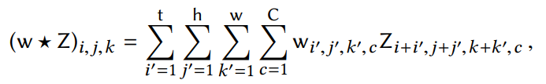
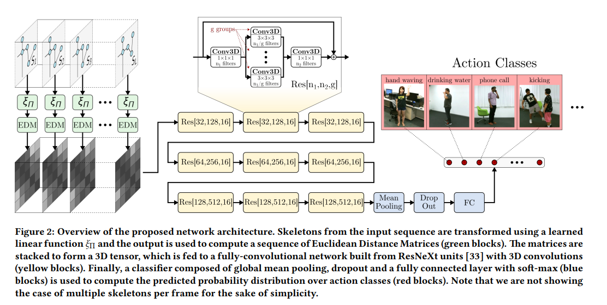
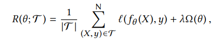

# 3D CNNs on Distance Matrices for Human Action Recognition

## This paper's Contributions

First, they implement by using Distance Matrices. There are defined over a learned transformation of the skeleton data.

Second, they proposed a Deep Neural Network with spatio-temporal Convolutional Operators. It is applied to Distance Matrices.

## Euclidean Distance Matrix (EDM)

Many Approaches try manipulate the input to enforce some form of invariance to rigid transformations.

rigid transformation은 skeleton data에 적용되는 변환 중, 형태나 상대적인 거리 구조를 유지하는 변환이다.

To achieve invariance to rigid transformation, this paper represents skeleton as distance matrices.

M개의 관절을 3차원 좌표로 표현한 행렬 Z에 대하여 Euclidean Distance Matrix을 구성합니다.

EDM are invariant to rigid transformations(translations, rotations, reflections), but EDM are not invariant to permutation(ordering of the joints).

따라서, permutation을 고정하지 않고 학습 가능한 선형 변환을 통해 가장 효과적인 joint를 찾도록 합니다.

There are two appraches which is encoding two skeleton using an EDM representation.

First is Decoupled Encoding. This encodes two skeletons independently, and apply edm(), and stacks two representations as two separate feature channels.

Second is Coupled Encoding. This concatenates two skeletons into a single matrix of points. And use edm() as encoding.

The encoding of skeleton data is applied to the entire sequence of skeletons. This adds temporal dimension. On Decoupled Encoding, L x J x J x 2 tensor is yielded. On Coupled Encoding, L x 2J x 2J is yielded.

## 3D CNNs over Distance Matrices

EDM 안에 있는 Local Structure를 효과적으로 학습하기 위해 CNN을 사용합니다. They consider time as an additional spatial dimension, so they propose 3D spatio-temporal Convolution.

This 3D CNN capture the temporal evolution of the local structures encoded by the EDMs.

3D Convolution is defined Eq1.

They proposed Figure2 which is a network architecture (DM-3DCNN) inspired by ResNeXt.

They repalced each convolution of ResNeXt to a spatio-temporal Convolution. And it performs the final global average pooling both over the spatial and time dimensions.

To Compensate for the increase number of parameters, they reduce the number of filters in each layer by a factor 2.

And they perform dropout on the inputs of the final FC layer.

## Network Training

Action Recognition 함수 f_\theta를 학습시켜야 한다.

모델의 학습은 다음 수식을 최소화하는 방식으로 이루어진다.

위 수식에서 손실함수 l은 log-loss를 사용합니다. 그리고 정규화 항은 l2 norm을 사용합니다.

## Training Detail

DM-3DCNN Network uses Stochastic Gradient Descent and Adam. Batch size is 32 and bata1 of Adam is 0.9 and beta2 of Adam is 0.999.

When they use NTU RGB+D and MSRC12 dataset, initial learning rate is 1e-3. After 40 Epochs, reducing it by a factor 10. And after next 60 epochs, reducing it by a factor 10.

They learned this model during 80 epochs.

SBU 데이터셋은 샘플 수가 적어서 처음부터 학습시키면 과적합의 위험이 있습니다. 따라서 NTU RGB+D에서 학습된 모델을 fine-tuning 합니다.

300회의 iteration 동안 learning rate를 1e-4에서 1e-5까지 지수적으로 감소시키면서 학습을 진행합니다.

## Conclusion

They presented a novel DNN architecture for refocnizing human actions from 3D skeleton data. Their approach is based on two main ideas.

First, Sequence of Skeletons are represented as sequences of euclidean distance matrix (EDM). This uses a learned transformation of the skeleton's joints.

Second, these sequences are processed using a 3D CNN (DM-3DCNN).

On NTU RGB+D dataset, they achieved an improvement in accuracy of 2% over the previous SOTA approach, while using almost 1000 times fewer parameters and operations.
