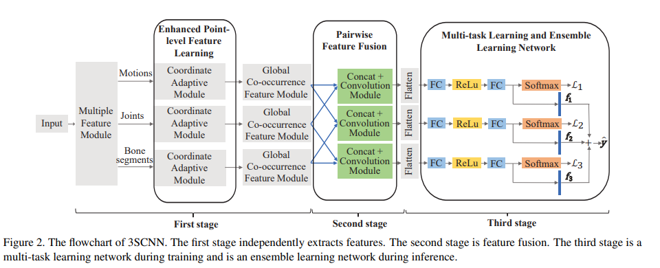

# Three-Stream Convolutional Neural Network with Multi-task and Ensemble Learning for 3D Action Recognition

## Korean

이 논문은 oriented bone segment를 추가해서, joint position, joint displacement(motion), oriented bone segment 총 세 가지의 스트림으로 구성된 네트워크를 제안합니다.

3D Joint Position은 skeleton의 Joint 3차원 좌표이고, Joint Displacement(motion)은 인접한 프레임 사이의 Joint 위치 변화량이고, Oriented Bone Segment는 인접한 두 Joint를 연결하는 vector입니다.

3SCNN 모델은 3단계로 구성되어 있는데, Feature Enhancement, Pairwise Feature Fusion, Multi-task and Ensemble Learning 입니다.

Feature Enhancement는 3가지 입력에 대해 각각 독립적으로 총 3가지의 특징을 추출하고 강화합니다.

Pairwise Feature Fusion은 3가지의 특징들 사이의 상호 보완적인 관계를 활용하기 위해 3개 중 임의의 2개를 묶어 쌍으로 특징을 융합합니다.

Multi-task and Ensemble Learning은 모델의 일반화 성능을 높이기 위해 multi-task로 학습하고 훈련하며, ensemble learning으로 추론합니다.

이를 통해 NTU RGB+D 데이터셋에서 뛰어난 성능을 보였습니다.

## Co-Occurrence Feature Learning with CNN

An action is associated with and characterized by the interactions and combinations of a subset of skeleton joints.

HCN's convolution operation is decomposed into two steps.

In first step, an independent convolution kernel slides on each channel of input. So the features are aggregated loccaly.

In second step, an elemnet-wise summation across channel is used. So the features are aggregated globally.

## Feature Enhancement

Bone segments provide the crucial cues to describe the human action. Because, bone segments can directly reflect the body's length and direction information.

The Coordinate Adaptive Module is designed to improve the enrich of action representation.

It does this by applying rotation transformations to the same skeleton sequence, cpatured from different viewpoints, to obtain multi-view information.

This module consists of Multi-Coordinate Transformation, Point-Level Convolution, Rotation Matrix Learning.

Multi-Coordinate Transformation generates sequence from various viewpoints using multiple rotation matrix.

Point-Level Convolution includes 1x1 and 1x3 Conv. The 1x1 Conv adaptively combines the L sequences obtained from different coordinate systems along the channel dimension.

The 1x3 Conv extracts point-level features along the temporal axis. These two layers are applied in sequence to effectively fuse the rotation-transformed information.

Rotation matrix learning treats rotation matrices as learnable parameters.

It uses L FC layers to learn each of the L rotation matrix directly from the data.

## Pairwise Feature Fusion Learning

Position, Motion, and Bone segment features are extracted independently.

Pairwise Feature Fusion (PFF) consists of two procedures which are pairing and fusing for each feature.

In pairing, any two of three features can be made a pair by concatenating operation. Then, there are two alternative fusion architectures in fusing. Two fusion architectures are shared fusion and split fusion.

In split fusion, each pairwise feature possesses exclusive fusion block to learn fusion pattern.

In shared fusion, learning the fusion pattern of the three pairs uses one shared block.

## Multi-task and Ensemble Learning Network

Three features after pairwise fusion learning are sent to their own classifier. And three-stream model predicts three probability vectors for each action.

This vectors are optimized using multi-task learning problem with cross-entropy loss and each classifier produces a loss component.

During inference, this paper refer to the main idea of ensemble learning.

Last FC layer fo each classifier is jointly used to make decision for human action recognition.

For mitigating the high level of noise to make ambiguous classification, this paper choose the sum of rule to joint these feature vectors. This is called Softmax...

## Conclusion

This paper proposed Three-Stream CNN model, 3SCNN.

This model handles the three kinds of inputs jointly. skeleton's position, motion and bone segment.

This paper designed the coordinate adaptive module to enrich feature expression.

And it proposed a pairwise feature fusion scheme and a multi-task ensemble learning network.

These take advantage of the complementary and diverse nature among multiple features.

3SCNN shows impressive performance on NTU RGB+D dataset and outperforms other SOTA methods.
