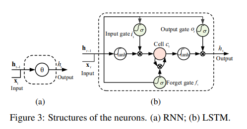
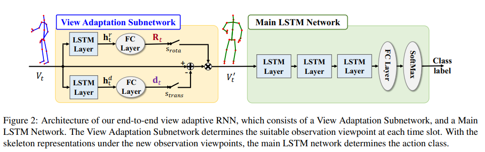
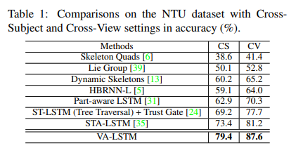
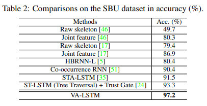
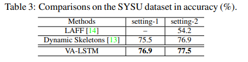
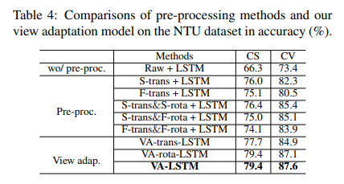

# View Adaptive Recuurent Neural Networks for High Performance Human Action Recognition from Skeleton Data

## Korean
기존의 방법인 사람이 정의한 전처리 방법은 운동 정보 손실과 최적 시점 탐색의 한계를 가집니다.

View Adaptation Subnetwork를 통해 네트워크스스로 최적의 시점을 학습하여 행동 인식 성능을 향상시킵니다.

View Adaptation Subnetwork와 Main LSTM을 결합해서 end-to-end model을 만들었습니다.

View Adaptation 에는 Rotation LSTM branch와 Translation LSTM branch로 구성되어 있고, 이 두 Branch에 각각 하나의 LSTM Layer와 FC Layer로 구성되어 있습니다. Main LSTM에는 3개의 LSTM Layer와 FC layer로 구성되어 있습니다.

이러한 End-to-End VA RNN은 사람이 정의한 전처리 한계를 극복하고 시점 변화에 강인한 행동 표현 학습을 통해 SOTA 성능을 달성했습니다.

## RNN and LSTM Overview

Standard RNN faces the vanishing gradient effect, which is not very capable of handling long-term dependencies.

In LSTM, the removal of the previous information or adition of the current information to the cell state are regulated with linear interactions by the forget gate and the input gate.

## View Adaptation Model using LSTM

Observation Coordiate System obtained from Global Coordinate System by translation and rotation.

View Adaptation module is end-to-end LSTM network.

View Adaption Subnetwork determine the observation viewpoint automatically.

View Adaptation Subnetwork is followed by Main LSTM Network that learning the temporal dynamics and performing the feature abstractions from the view-regulated skeleton data for action recognition.

Two branches of LSTM takes skelton V_t as input. This LSTM subnetworks are utilized to learn the rotation parameters to obtain the rotation matrix, and to learn the translation vector. This parameters are corresponded to the global coordinate system.

The branch of rotation subnetwork for learning rotation parameters consists of an LSTM layer and a FC layer.

The branch of translation subnetwork for learning translation parameters consists of an LSTM layer and a FC layer.

The Main LSTM network consists of three LSTM layers which is followed by one FC layer with softmax classifier.

With end-to-end training, the view adaptation model is guided to select the suitable observation viewpoints for enhancing recognition accuracy.

## Experiment

## Conclusion
View Adaptive Network is End-to-End Model for human action recognition.

VA Network is capable of regulating the observation viewpoint to the suitable ones by itself.

It overcomes the limitations of the human defined pre-processing approaches.

The proposed model improves recognition performance on three benchmark datasets and achieve SOTA results.
