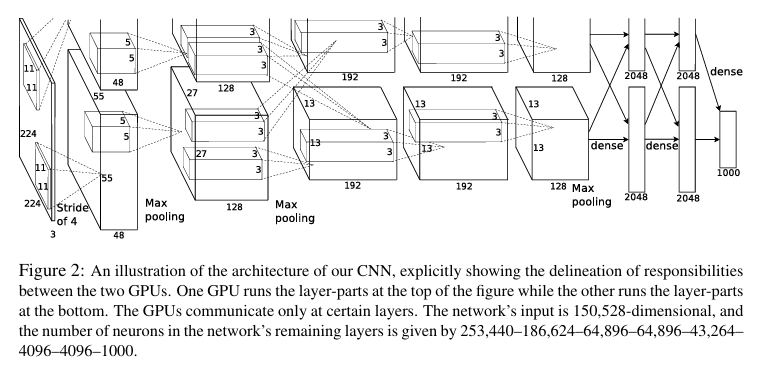

# AlexNet

## 핵심 아이디어

## 방법론

### DataSet
ImageNet is a dataset of over 15M labeled high resolution images with 22,000 categories.

This paper down-sampled the images to a fixed resolution of 256 x 256. This paper only pre-process the image that subtracting the mean activity over the training set from each pixel.

### Architecture

It contains eight learned layers that consist of five convolutional layers and three fully-connected layers.

It has 1000-way softmax. That is, the model is capable of classifying 1,000 categories.

This network maximizes the multinomial logistic regression objective.

The kernel of Second, Fourth, Fifth Conv Layers are connected only to those kernel map in the previous layer which reside on same GPU. But the kerenl of Thrid Conv Layers are connected to all neurons in the previous layer.

Response Normalization layers follow teh First and Second Conv Layers.

Max-pooling Layers follow both response normalization layers and Fifth Conv layers.

ReLU is applied to the output of every conv and fully-connected layer.

Input image size of First Conv layer is 224 x 224 x 3. This Conv Layer filters input images with 96 kernels of size 11 x 11 x 3 with a stride of 4 pixels.

Second Conv Layer takes input which is output of the First Conv Layer. And then Second Conv Layer filters it with 256 kernels of size 5 x 5 x 48.

Third and Fourth and Fifth Conv layers are connected to one another without any interventing pooling or normalization layers.

Third Conv Layer has 384 kernels of size 3 x 3 x 256 and Fourth has 384 kernels of size 3 x 3 x 192 and Fifth has 256 kernels of size 3 x 3 x 192.

The Fully-connected layers have 4096 neurons each.

#### ReLU
It contains ReLU Nonlinearity. Saturating Nonlinearities such as tanh(x) or f(x) = (1+e^-x)^-1 are much slower than the non-saturating nonlinearity.

DCNN with ReLU train several times faster than tanh. This is demonstrated in Figure 1.

#### Multiple GPU
This paper put half of the kernels on each GPU.

The two-GPU network takes slightly less time to train than the one-GPU.

#### Local Response Normalization
Local Response Normalization aids generalization.

This is reduce Top-1 and Top-5 error rate by 1.4% and 1.2%.

#### Overlapping Pooling
Pooling layers in CNN summarize outputs from nearby neuron groups within a kernel map. Overlapping Pooling reduces Top-1 and Top-5 error rate by 0.4% and 0.3%, as ccompared with the non-overlapping pooling.

### Reduce Overfitting
#### Data Augmentation
The Transformed images are generated in Python Code on the CPU while GPU is training on the previous batch of images.

Data augmentation consists of generating images translations and horizontal reflections. This paper does this by extracting random 224 x 224 patches from the 256 x 256 images and training networks on these extracted patches.

Additionally, Data augmentation consists of altering the intensites of the RGB channels in training images. This paper performs PCA on the set of RGB pixel value throughout the ImageNet training set. To each training image, this paper adds multiples of the found principal components with magnitudes proportional to the corresponding eigenvalues times a random variable drawn from a Gaussian with mean zero and standard deviation 0.1.

This augmentation method approximates the property that the identity of an object is preserved under variations in lighting intensity and color. Unlike simple brightness adjustment, this method enhances diversity while preserving the overall color statistics of the image.

## 결론
On ILSVRC-2010, this paper achieves Top-1 test set error rates of 37.5% and Top-5 test set error rates of 17.0%.

On ILSVRC-2012, this paper achieves Top-5 error rate of 18.2%.

Averaging predictions of two CNN that pre-trained on entire Fall 2011 and five CNN gives an error rate of 15.3%.

On Fall 2009, this paper achieves Top1 error rates of 67.4% and Top-5 error rates of 40.9%.

Two images that have feature activation vectors with a small Euclidean separation are similar. And then Neural Network consider this two images to be similar.

This Euclidean distance between two 4096-dimenstional real-value vectors are inefficient, but short binary codes which compressed these vectors are efficient.

Paper's network demonstrates that depth is important for achieving high performance.
