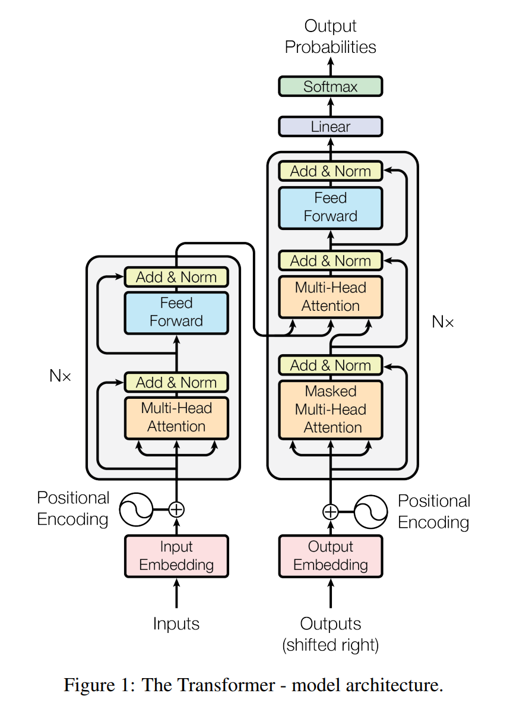
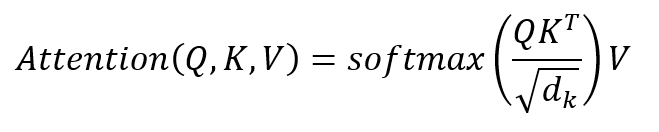

# Attention Is All You Need Summary
## 논문 정보
제목: Attention Is All You Need

저자: Ashish Vaswani, Noam Shazeer, Niki Parmar, Jakob Uszkoreit

## Abstract 요약
도메인 시퀀스 변환 모델은 복잡한 RNN이나 CNN을 기반으로 했고, 이 중 좋은 성능을 내는 모델은 인코더와 디코더를 Attention Mechanism으로 연결한 모델입니다.

이 논문은 Attention Mechanism만을 사용하는 Transformer를 제안합니다.

기계번역 과제에 대해서, 품질이 우수하고 병렬처리를 잘 할 수 있고 학습 시간이 많이 줄어들었습니다.

## 문제 정의 및 동기
자연어 처리와 기계번역처럼 시퀀스 변환 과제에서 기존에는 RNN과 LSTM이 사용되었습니다.

하지만 순차적인 연산 특징 때문에 병렬 연산이 불가능해서 문장의 길이가 길어지면 모델의 학습 시간이 크게 늘어나는 단점이 존재했습니다. 한편, CNN을 사용한다면 은닉 표현의 병렬 연산이 가능하지만 위치 사이의 거리가 길수록 연산량이 기하급수적으로 증가하여 학습에 어려움을 겪게 됩니다.

이러한 문제점을 해결하기 위해 self-Attention 매커니즘과 Transformer를 제안했습니다.

## 핵심 아이디어
### Self-Attention
## 방법론
### Transformer

### Transformer Encoder
Transformer 모델은 6개의 인코더와 6개의 디코더로 이루어진 모델입니다. 인코더에는 총 2개의 Sub Layer가 있습니다.

그 중 첫 번째 Sub Layer는 1개의 Multi-Head Self-Attention이고, 두 번째 Sub Layer는 1개의 Position-wise Fully Connected Feed-Forward Network 입니다.

디코더에는 인코더의 2개의 Sub Layer에 추가로 하나의 Multi-Head Attention이 더 있습니다. Multi-Head Attention은 인코더의 출력 정보를 활용할 수 있습니다.

즉, 이 Multi-Head Attention은 Key와 Value를 인코더에서 받고, Query를 디코더에서 받습니다.

각각의 Sub Layer들은 Residual Connection을 적용한 후 Layer Normalization이 적용됩니다. 위 그림에서 Add&Norm이 Residual Connection과 Layer Normalization입니다.

이러한 기법들을 통해 다음과 같은 이점을 얻을 수 있습니다. Residual Connection을 통해 기울기 소실 문제와 정보 손실 문제를 해결할 수 있고, Layer Normalization을 통해 학습 안정성을 향상시킬 수 있습니다.

Residual Connection은 Multi-Head Attention의 뒤와 Position-wise Fully Connected Feed-Forward Network의 뒤에 각각 적용됩니다. Sub Layer의 입력을 x라고 하면, 최종 출력인 Output은 다음 수식을 따릅니다:

Output = LayerNorm(x + SubLayer(x)). 여기서 SubLayer(x)는 Multi-Head Attention 또는 Position-wise Fully Connected Feed-Forward Network의 출력입니다.

### Multi-head Attention
Multi-Head Attention은 Query, Key, Value에 h번의 Linear Projection을 수행한 뒤, 각각에 Attention 함수를 병렬로 수행하여 d_v 차원의 출력 값을 얻습니다. 이 때 Transformer 논문에서 h를 8로 설정했습니다.

h번의 Linear Projection을 수행하는 이유는 병렬적으로 학습하여 서로 다른 의미적 관계를 학습하기 위해서입니다. 이렇게 되면 정교한 표현 학습이 가능해집니다.

여기서 Linear Projection이란, 입력 벡터에 선형 변환을 적용하는 연산을 의미합니다. Transformer는 각 Q, K, V에 가중치 행렬 W를 곱하는 것으로 Linear Projection을 수행합니다.

이제 h개의 각 Head에서 독립적으로 Scaled Dot-Product Attention을 수행합니다.

Scaled Dot-Product Attention의 입력은 d_k 차원인 Query, Key와 d_v 차원인 Value로 구성됩니다. 입력된 Query와 Key 사이에 dot product를 계산하고, sqrt(d_k)로 나눈 뒤, Softmax 활성화 함수를 적용해서 Value에 대한 가중치를 얻습니다.

Scaled-Dot Product Attention의 수식은 다음과 같습니다:

## 실험 결과

## 결론

## 느낀점
