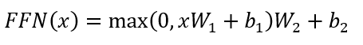

# Attention Is All You Need Summary
## 논문 정보
제목: Attention Is All You Need

저자: Ashish Vaswani, Noam Shazeer, Niki Parmar, Jakob Uszkoreit

## Abstract 요약
도메인 시퀀스 변환 모델은 복잡한 RNN이나 CNN을 기반으로 했고, 이 중 좋은 성능을 내는 모델은 인코더와 디코더를 Attention Mechanism으로 연결한 모델입니다.

이 논문은 Attention Mechanism만을 사용하는 Transformer를 제안합니다.

기계번역 과제에 대해서, 품질이 우수하고 병렬처리를 잘 할 수 있고 학습 시간이 많이 줄어들었습니다.

## 문제 정의 및 동기
자연어 처리와 기계번역처럼 시퀀스 변환 과제에서 기존에는 RNN과 LSTM이 사용되었습니다.

하지만 순차적인 연산 특징 때문에 병렬 연산이 불가능해서 문장의 길이가 길어지면 모델의 학습 시간이 크게 늘어나는 단점이 존재했습니다. 한편, CNN을 사용한다면 은닉 표현의 병렬 연산이 가능하지만 위치 사이의 거리가 길수록 연산량이 기하급수적으로 증가하여 학습에 어려움을 겪게 됩니다.

이러한 문제점을 해결하기 위해 self-Attention 매커니즘과 Transformer를 제안했습니다.

## 핵심 아이디어
### Position Encoding
언어는 순서에 따라 의미가 결정되기 때문에, 의미를 구별하기 위해서는 토큰의 순서 정보가 필요합니다.

input embedding만으로는 토큰의 순서를 알 수 없어서, 토큰의 순서 정보를 사용하기 위해 Position Encoding을 사용합니다.

Transformer에서는 사인 코사인 함수를 사용한 fixed Positional Encoding을 사용합니다.

### Self-Attention
동일한 시퀀스 내의 토큰들이 서로 참조하면서 각 위치의 표현을 갱신하는 기법입니다.

시퀀스란, 모델에 입력되는 토큰들의 순서 있는 나열입니다. 5개의 단어로 이루어진 문장은 5개의 토큰으로 이루어진 시퀀스입니다.

입력 시퀀스의 각 위치에서 선형 투영을 통해 Queary, Key, Value 벡터를 만들기 때문에 Self 라는 단어가 붙었습니다.

Self-Attention을 통해 거리가 먼 시퀀스 사이의 관계를 효과적으로 학습할 수 있고, 연산의 병렬 처리가 가능합니다.

### Masked Multi-head Attention
미래 토큰 정보를 참조하지 않도록 softmax 계산을 할 때, 해당 위치 이후의 토큰들을 -무한대로 마스킹해서 auto-regressive 특성을 유지합니다.

auto-regressive는 지금까지 생성된 값들에만 의존하여 다음 값을 예측하는 방식입니다.

## 방법론
### Transformer

### Transformer Encoder
Transformer 모델은 6개의 인코더와 6개의 디코더로 이루어진 모델입니다. 인코더에는 총 2개의 Sub Layer가 있습니다.

그 중 첫 번째 Sub Layer는 1개의 Multi-Head Self-Attention이고, 두 번째 Sub Layer는 1개의 Position-wise Fully Connected Feed-Forward Network 입니다.

디코더에는 인코더의 2개의 Sub Layer에 추가로 하나의 Multi-Head Attention이 더 있습니다. Multi-Head Attention은 인코더의 출력 정보를 활용할 수 있습니다.

즉, 이 Multi-Head Attention은 Key와 Value를 인코더에서 받고, Query를 디코더에서 받습니다.

각각의 Sub Layer들은 Residual Connection을 적용한 후 Layer Normalization이 적용됩니다. 위 그림에서 Add&Norm이 Residual Connection과 Layer Normalization입니다.

이러한 기법들을 통해 다음과 같은 이점을 얻을 수 있습니다. Residual Connection을 통해 기울기 소실 문제와 정보 손실 문제를 해결할 수 있고, Layer Normalization을 통해 학습 안정성을 향상시킬 수 있습니다.

Residual Connection은 Multi-Head Attention의 뒤와 Position-wise Fully Connected Feed-Forward Network의 뒤에 각각 적용됩니다. Sub Layer의 입력을 x라고 하면, 최종 출력인 Output은 다음 수식을 따릅니다:

Output = LayerNorm(x + SubLayer(x)). 여기서 SubLayer(x)는 Multi-Head Attention 또는 Position-wise Fully Connected Feed-Forward Network의 출력입니다.

### Multi-head Attention
Multi-Head Attention은 Query, Key, Value에 h번의 Linear Projection을 수행한 뒤, 각각에 Attention 함수를 병렬로 수행하여 d_v 차원의 출력 값을 얻습니다. 이 때 Transformer 논문에서 h를 8로 설정했습니다.

h번의 Linear Projection을 수행하는 이유는 병렬적으로 학습하여 서로 다른 의미적 관계를 학습하기 위해서입니다. 이렇게 되면 정교한 표현 학습이 가능해집니다.

여기서 Linear Projection이란, 입력 벡터에 선형 변환을 적용하는 연산을 의미합니다. Transformer는 각 Q, K, V에 가중치 행렬 W를 곱하는 것으로 Linear Projection을 수행합니다.

이제 h개의 각 Head에서 독립적으로 Scaled Dot-Product Attention을 수행합니다.

Scaled Dot-Product Attention의 입력은 d_k 차원인 Query, Key와 d_v 차원인 Value로 구성됩니다. 입력된 Query와 Key 사이에 dot product를 계산하고, sqrt(d_k)로 나눈 뒤, Softmax 활성화 함수를 적용해서 Value에 대한 가중치를 얻습니다.

Scaled-Dot Product Attention의 수식은 다음과 같습니다:

그 다음에 h개의 Attention 결과를 이어붙이고 최종적으로 다시 Linear Projection을 수행하여 최종 출력 값을 만듭니다.

인코더의 첫 번째 Sub Layer인 Multi-Head Self-Attention에서는 입력 시퀀스의 모든 위치마다 동일한 입력을 Qeury, Key, Value로 사용하고 시퀀스 내의 서로 다른 위치 간의 의존성을 학습합니다. 

### Transformer Decoder
디코더의 첫 번째 Sub Layer인 Masked Multi-Head Attention에는 미래의 위치를 알 수 없게 하기 위해 마스킹을 적용하고 현재 위치의 이전 토큰들만 참조하게 합니다.

디코더의 두 번째 Sub Layer인 Multi-Head Attention에서는 디코더가 생성한 Query와 인코더에서 나온 Key와 Value를 사용하여 디코더의 각 위치가 입력 문장 내에 모든 위치를 참조할 수 있게 합니다. 

디코더의 세 번째 Sub Layer인 Feed-Forward Network는 각 위치별로 동일한 2개의 완전 연결 네트워크를 적용시킵니다. 이 네트워크는 ReLU 활성화를 사이에 둔 2개의 선형 변환으로 구성되고, 수식은 다음과 같습니다:

이 선형 변환은 서로 다른 위치에 동일하게 적용되지만 레이어마다 서로 다른 매개변수를 사용합니다.

추가적으로, 입력과 출력의 토큰을 벡터로 변환하기 위해 Learned Embedding을 사용했고, 시퀀스의 순서를 활용하기 위해 인코더와 디코더의 하단 입력 임베딩에 Position Encoding을 추가했습니다.

Position Encoding은 입력 임베딩과 동일한 차원을 가지기 때문에 이 둘을 합칠 수 있습니다. Position Encoding 방식에는 다양한 방식이 있는데, 이 논문에서는 사인 함수와 코사인 함수를 사용하여 Position Encoding을 정의했습니다.

이는 위치 정보를 주기적 주파수 함수로 표현해서 모델이 상대적인 위치를 잘 학습하도록 도와줍니다.

## 실험 결과

## 결론
계산 복잡도 측면에서 Recurrent Layer 보다 Self-Attention Layer가 더 빠르고, Convolu-tion Layer보다 Self-Attention Layer가 계산 비용이 더 저렴합니다.

Self-Attention은 더 해석 가능한(interpretable) 모델을 만들 가능성이 있습니다. 

기계 번역에서 Transformer는 Recurrent와 Convolutional 보다 빠르게 학습되고 좋은 성능을 보여줬고, 앙상블(Ensemble) 모델보다 성능이 더 뛰어납니다.

## 느낀점
