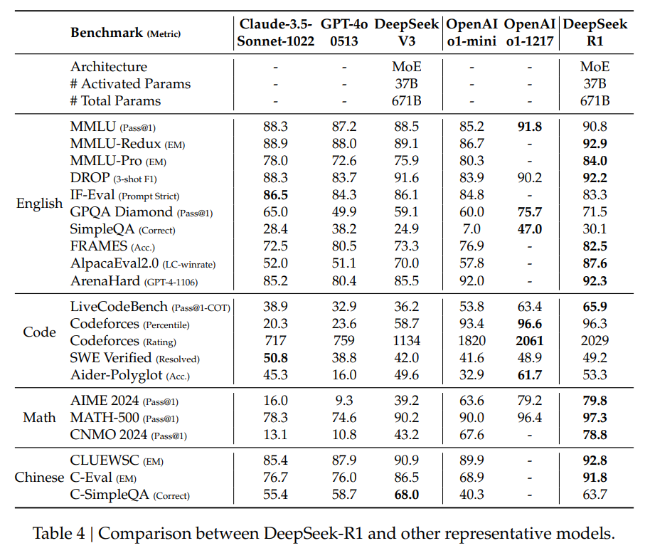
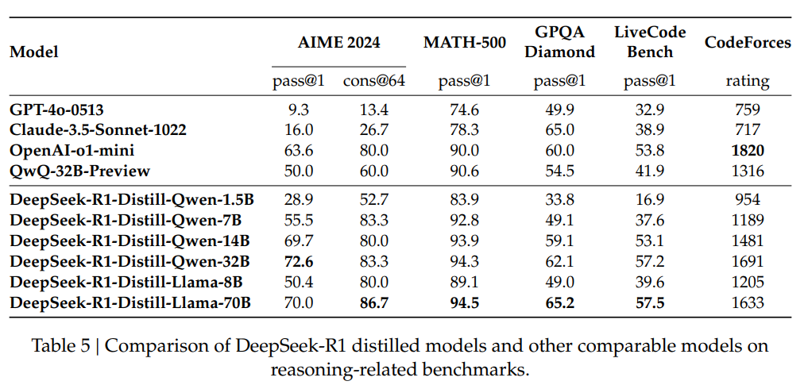

# DeepSeek-R1 summary
## 논문 정보
제목: DeepSeek-R1: Incentivizing Reasoning Capability in LLMs via Reinforcement Learning

저자: DeepSeek-AI

## Abstract 요약
DeepSeek-R1-Zero는 Supervised Fine-Tuning을 사용하지 않고 대규모 Reinforcement Learning만을 통해 학습된 모델입니다.

R1-Zero이 생성한 문장은 가독성이 떨어지고 언어가 뒤섞이는 문제가 있습니다. 이러한 문제를 해결하기 위해, DeepSeek-R1이 나왔습니다.

R1은 여러 단계의 학습과 Cold-Start 데이터를 포함하여 학습됩니다.

R1은 OpenAi-o1과 비슷한 성능을 달성했습니다.

## 문제 정의와 동기
R1-Zero는 순수한 강화 학습만을 사용하여 언어 모델의 추론 능력을 향상시켰습니다. 즉, Cold Start 없이 RL만 사용하여 훈련을 시작했습니다.

하지만 가독성이 낮고 여러 국가의 다양한 언어가 혼합되는 문제점이 발생했습니다
## 핵심 아이디어
### Reinforcement Learning
Agent가 환경과 상호작용하면서 보상을 최대화하기 위해 학습하는 방식입니다. Agent가 환경과 상호작용하면서 상태(s)를 관찰하고 행동 (a)를 선택합니다.

선택한 행동의 결과로 보상을 받고 이후 상태로 전달됩니다.

RL의 목표는 장기적인 누적 보상을 최대화하는 정책을 학습하는 것입니다.

### Cold Start
Cold Start는 RL을 시작하기 전에 일정한 양의 고품질 데이터로 Supervised Fine-Tuning을 먼저 수행하는 것입니다.

Cold Start 없이 학습을 시작했을 때의 불안정한 학습 초기 단계를 Cold Start를 사용하여 피할 수 있습니다.

초기의 안정된 추론 능력을 갖추면 RL의 훈련 속도가 빨라지고 결과의 품질이 좋아집니다.

### SFT(Supervised-Fine-Tuning)
지도 학습 방식으로 모델을 미세 조정하는 과정입니다.

RL을 시작하기 전에 Chain-of-Thought 데이터를 사용해서 SFT를 수행합니다. 그리고 RL이 수렴한 뒤에 해당 체크포인트를 사용해서 새로 정답이 검증된 출력들을 수집하고, 이를 사용해서 SFT를 수행하여 더 넓은 도메인에 대응합니다.

## 방법론
R1이 Cold-Start를 진행하기 위해, 소량의 긴 Chain-of-Thought Data를 구축하고 수집합니다. 여기서 CoT Data란, 모델이 복잡한 문제를 풀 때 논리적 사고 과정을 포함한 데이터를 말합니다.

일반적인 데이터는 입력에 질문이 있고 출력에 정답이 있는 데이터이지만, CoT 데이터는 일반적인 데이터의 입출력 사이에 논리적 추론 과정이라는 데이터가 추가됩니다.

이러한 CoT Data를 모으기 위해, 모델에게 CoT 데이터 예제 몇 개를 보여주고 이를 바탕으로 모델이 긴 CoT 답변을 생성하도록 유도하는 Few-Short Prompting 방법과, 모델에게 자기검증(reflection and verification)을 요구하여 구체적인 답변을 생성하도록 직접 Prompt를 제공하는 방법과, R1 Zero의 출력을 읽을 수 있는 포멧으로 모으는 방법과 사람에 의한 후처리를 통해 출력을 정제하는 방법을 사용합니다.

이를 통해 수천개의 Cold-Start Data가 모았습니다

Cold-Start와 Reinforcement Learning을 진행하여 논리적 추론 능력을 학습합니다. 이 때 CoT의 언어 혼합을 줄이기 위해 언어 일관성 보상을 사용합니다.

이렇게 학습된 모델을 사용하여 더 많은 학습 데이터를 수집하고, SFT(Supervised-Fine-Tuning)을 적용하여 모델의 성능을 개선합니다.

효과적으로 SFT를 수행하기 위해 고품질 학습 데이터가 필요한데, 추론 데이터와 비추론 데이터로 나누어 생성하고자 합니다.

추론 데이터는 추론 프롬프트를 선별한 뒤 Rejection Sampling을 수행하여 추론 경로를 생성하고 정답과 모델 예측을 V3 모델에 줘서 판단하는 Generative Reward Model을 사용합니다. 만약 모델의 출력이 혼란스럽거나 가독성이 떨어질 경우, CoT와 길이가 너무 긴 문장과 코드 블록을 필터링하여 해결합니다.

비추론 데이터는 V3 파이프라인을 채택한 뒤 V3의 SFT Dataset의 일부를 재사용하여 생성합니다. 이 중 특정한 비추론 작업의 경우, 질문에 대한 답을 하기 전에 V3 모델을 호출하여 잠재적인 CoT Data를 생성하도록 합니다.

여기까지 진행하여도 사람이 원하는 방식으로 반응하도록 보장할 수 없습니다.

따라서 사용자에게 유용한 답변을 제공하도록 유도하는 Helpfulness를 향상시키고, 모델이 편향된 정보나 공격적인 발언 및 유해한 콘텐츠를 생성하지 않도록 유도하는 Harmlessness를 향상시키고, 추론 능력을 더욱 개선하기 위해 추가적인 Reinforcement Learning을 진행합니다.

이 때 추론 데이터는 R1 Zero 방법인 Rule-base Rewards 시스템을 활용하여 학습을 시켰습니다. 일반 데이터는 V3 파이프라인을 통한 Reward Model을 사용하여 학습하시켰습니다

Helpfulness는 답변의 최종 요약에 초점을 맞춰 평가 했으며, 추론 과정에 영향을 최소로 주도록 설정했습니다. Harmlessness는 모델이 생성한 전체 답변을 평가했고, Helpfulness와 다르게 추론 과정과 요약이 모두 포함됩니다.

## 실험 결과

Claude-Sonnet, GPT-4o, OpenAI-o1 등을 포함한 여러 강력한 기준 모델들과 비교하여 종합적인 평가를 수행했습니다

DeepSeek-R1의 출력을 증류하여 경량화된 DeepSeek-R1-*B에 대한 평가를 수행했습니다.

## 결론
이 논문은 Reinforcement Learning을 통해 모델의 추론 능력을 향상시키는 과정을 연구했습니다. R1 Zero는 Cold Start 데이터에 의존하지 않은 순수한 RL이지만, R1은 Cold Start 데이터와 반복적인 RL Fine-Tuning을 결합하여 더 강력한 성능을 보였습니다. 그 결과, R1은 다양한 과업에서 o1과 동등한 성능을 보였습니다.

또한 증류(Distillation) 방법으로 작은 모델이 좋은 성능을 달성하도록 했습니다.

하지만 R1모델은 영어와 중국어에 최적화돼 있어서, 추후 다른 언어로 최적화가 필요합니다.

R1을 평가하는 과정에서 모델이 프롬프트 엔지니어링에 민감하게 반응하는 경향이 있습니다. 따라서 사용자는 최적의 결과를 얻기 위해 문제를 직접 설명하고 출력 형식을 지정하는 Zero-shot 설정을 사용하는 것이 권장됩니다.

## 느낀점

