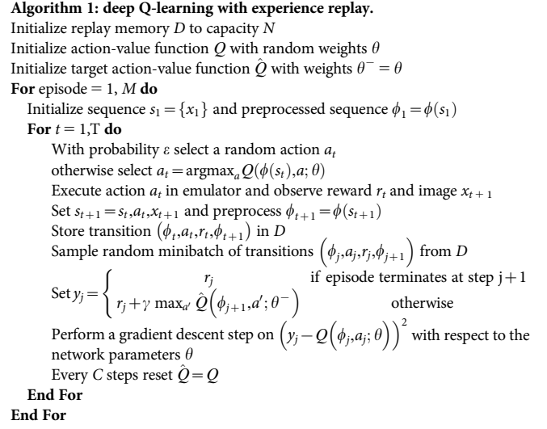
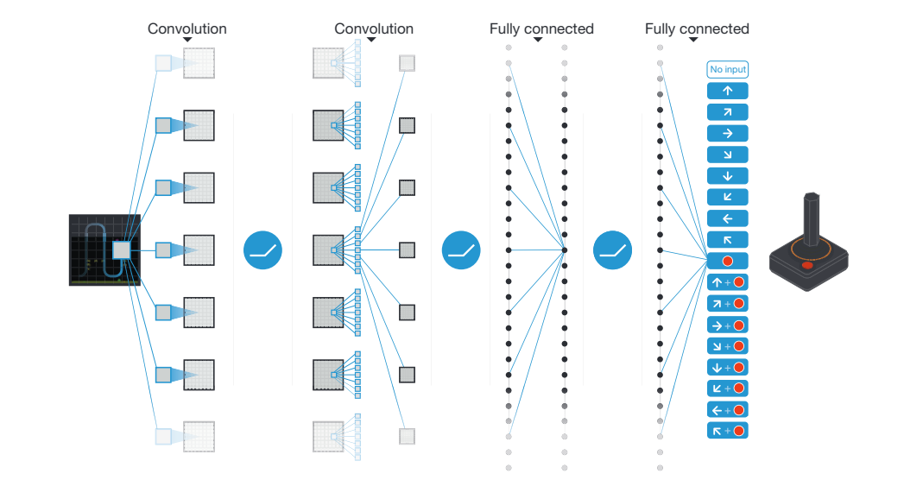
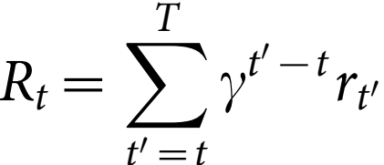
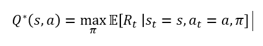
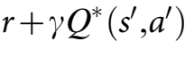
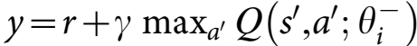
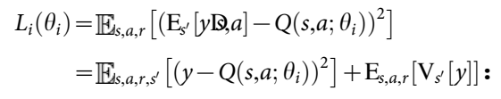
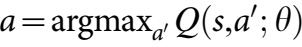
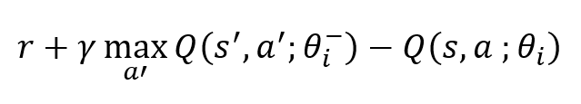

# Deep Q-network paper summary

## 1. 논문 정보
제목: Human-level control through deep reinforcement learning

저자: Volodymyr Mnih, Koray Kavukcuoglu, David Silver, Andrei A.Rusu, JeoVeness, Marc G.Bellemare, Alex Graves

## 2. Abstract 요약
실제 환경에서 강화학습을 성공적으로 적용하기 위해, Agent는 고차원의 sensory 입력으로부터 환경의 효율적인 표현을 추출하고 과거의 경험을 새로운 환경에 일반화해야 합니다.

기존의 강화학습 Agent는 다양한 분야에서 일부분 성공했지만, 적용 범위가 사람이 직접 설계할 수 있는 분야이거나 관측 가능한 저차원 상태 공간을 가지는 분야로 제한되었습니다.

이 논문은 Deep Neural Network의 최신 훈련 기법 [a](https://www.nowpublishers.com/article/Details/MAL-006), [b](https://proceedings.neurips.cc/paper/2012/hash/c399862d3b9d6b76c8436e924a68c45b-Abstract.html), [c](https://www.science.org/doi/abs/10.1126/science.1127647) 를 사용해서 Deep Q-network를 개발했습니다. 이 Agent는 고차원 sensory 입력으로부터 성공적인 정책을 직접 학습할 수 있고, 이를 end-to-end 강화학습 방식으로 수행합니다.

이 agent는 클래식 Atari 2600 게임에서 테스트되었고, 픽셀과 게임 점수만 입력 받은 상태에서 기존의 모든 알고리즘의 성능을 넘어섰습니다. 그리고 49개의 게임에서 전문 게임 테스트 수준에 도달하는 성과를 보여줬습니다. 

## 3. 문제 정의 및 동기
기존의 강화학습 방법들은 사람이 직접 설계한 특징이나 완전히 관측 가능한 저차원 상태 공간에서만 적용할 수 있는 문제가 있습니다.

따라서 실제 세계처럼 고차원 Sensory 입력으로 이루어진 환경에서는 제대로 동작하기 어렵습니다.

이에, Agent가 고차원 Sensory 입력으로부터 효율적인 표현을 스스로 학습하고, 이를 바탕으로 과거 경험을 새로운 상황에 일반화시킬 수 있는 end-to-end 방법이 필요했습니다. 이를 해결하고자 한 것이 Deep Q-Network 입니다.

## 4. 핵심 아이디어

---
start//

강화학습과 Deep Convolutional Network를 결합했습니다. DCN의 계층적 Conv Filter는 Receptive Field 효과를 모방하고, 이를 통해 이미지 내에 존재하는 Local 공간 상관관계를 활용하고 viewpoint나 scale의 변화와 같은 자연스러운 변형에 대한 강인성을 구축합니다.

강화학습 Agent를 개발할 때 우리는 관찰, 행동, 보상의 시퀀스에 대한 환경과 상호작용하는 과업을 고려했습니다. Agent의 목표는 미래 누적 보상을 극대화할 수 있는 방식으로 행동을 선택하는 것이니다. 최적의 action-value 함수 를 근사하기 위해 Deep Convolutional Network를 사용합니다.
eq1 수식은 각 시각 t에서 할인율 gamma를 적용한 보상 r_t의 최대 합이고, 상태 s를 관찰한 후 행동 a를 선택하는 정책인 pi = P(a|s)에 의해 달성됩니다.

강화학습은 nonlinear function approximator를 사용하여 action-value 함수(Q함수)를 표현할 때, 불안정하거나 수렴이 안되는 현상이 있습니다. 이에 대한 원인은 관찰 순서에 대한 상관관계, Q의 작은 업데이트가 정책을 변경시켜 데이터 분포가 바뀌거나, Q함수와 목표값 사이의 상관관계입니다.

위 3가지 원인을 해결하기 위해 새로운 Q-Learning의 변형을 제안합니다. 이에 대한 핵심 아이디어는 "experience Replay"과 "Target Network"입니다. 데이터를 무작위함으로써 관찰 시퀀스 내의 상관관계를 제거하고 데이터 분포 변화에 대한 smoothing을 얻습니다. 그리고 Target Network를 사용해서 Q함수를 주기적으로만 갱신되는 목표값에 맞춰서 조정함으로써 목표값과 상관관계를 줄입니다.

Deep Convolutional Neural Network를 통해 Q(s, a, theta)를 매개변수화 시킴으로써 네트워크를 처음부터 다시 학습시켜야 하는 문제를 해결했습니다.

End//

---

raw pixel로부터 end-to-end 강화학습을 합니다. 기존의 강화학습은 사람이 직접 설계한 특징이나 저차원 상태에서만 가능했지만, 이 논문은 영상 프레임을 가공하지 않고 그대로 네트워크 입력으로 사용합니다.

이를 통해 Agent는 자동으로 환경의 효율적인 표현을 핛브하고 과거 경험을 새로운 상황에 일반화시킬 수 있습니다.

강화학습 안정화를 위해 아래 2가지인 Experience Replay와 Target Network 방법을 사용합니다.
Experience Replay는 과거의 (state, action, reward, next state) 샘플을 메모리에 저장했다가 무작위로 뽑아 학습함으로써 샘플 사이의 상관관계를 제거하고 데이터의 효율을 높입니다.

---
Start//

experience replay을 수행하기 위해, 각 시각 t마다 Agent의 경험 e를 e_t=(s_t, a_t, r_t, s_t+1) 형태로 만들어서 데이터셋 D_t={e_1,...,e_t}에 저장합니다. 학습을 할 때, 여기서 무작위로 샘플을 선택해서 Q-Learning을 수행합니다. Q-learning을 업데이트 할 때  손실 함수를 사용합니다. 이 때 gamma는 할인율로 agent의 미래 horizon을 결정하고, theta_i는 현재 반복 단계 i에서의 Q-Network 파라미터이고, theta^-_i는 같은 반복 단계에서 target Network를 위한 파라미터입니다. 이 theta^-_i는 C 단계마다 한 번씩만 Q-network 파라미터 theta_i로 업데이트 되고, 이외에는 고정된 상태로 유지됩니다.

End//

---

Target Network는 일정 간격으로만 업데이트 되는 고정된 네트워크를 타겟 값 계싼에 사용해서 Q-Value 값 추정의 발산을 억제합니다. 이를 통해 학습 안정성을 확보합니다.

Deep Convolutional Neural Network와 Q-learning을 융합했습니다.
네트워크의 계층적인 Convolution 필터는 생물학적 Receptive Field와 유사하게 작동하기 때문에, 이미지 내의 Local spatial Correlations를 학습하고, Viewpoint와 scale 변화에 강인한 표현을 구축합니다. 이렇게 DCNN과 Q-learning을 융합함으로써 복잡한 시각 입력 환경에서 인간 수준의 정책을 학습할 수 있습니다.

## 5. 방법론
### Preprocessing
Atari 2600의 프레임인 210x160 픽셀 이미지를 그대로 사용하면 연산 및 메모리 요구량이 커질 수 있어서, 다음과 같은 두 가지 전처리 과정을 수행했습니다.

단일 프레임을 인코딩할 때 현재 프레임과 이전 프레임의 각 픽셀 값 중 최대값을 선택합니다. 이를 통해 짝수 프레임에만 또는 홀수 프레임에만 나타나는 flickering 현상을 제거할 수 있습니다.

위에서 얻은 RGB 이미지에서 Y 채널(휘도: luminance)만 추출한 뒤 84x84 크기로 rescale 합니다. 아래 DQN algorithm1의 함수 φ는 이러한 전처리를 최근 m개 프레임에 적용하고 쌓아서 Q-function의 입력으로 사용합니다. 기본값은 m=4 입니다.

### Model Architecture
Q-function을 신경망으로 매개변수화 하는 과거 방법에는 (s, a) 한 쌍을 네트워크에 입력하면 그 한 쌍에 대한 Q-Value 한 개만 출력하는 구조였습니다. 그래서 가능한 행동이 n개라면 n번의 네트워크를 돌려야 n개의 Q-Value를 구할 수 있었습니다. 이는 n개의 행동 수에 비례해서 연산 비용이 선형으로 증가한다는 단점이 됩니다.

이 논문의 DQN은 모든 행동마다 별도의 출력 유닛을 두고 신경망 입력으로 state representation, 즉 상태 s만을 사용합니다. 출력층의 각 유닛은 입력 상태에 대한 개별 행동의 predicted Q-value만 나타내며, 이러한 방식은 한 번의 순전파만으로 주어진 상태의 모든 행동에 대한 Q-Value를 계산할 수 있어서 빠르고 효율적이다는 장점이 있습니다.

Figure1의 아키텍처는 DQN의 네트워크 구조입니다. 입력에는 전처리 함수 φ를 통과한 84 x 84 x 4 크기의 이미지가 있습니다. 즉, 전처리된 최근 4개의 raw pixels 스택이 입력으로 들어갑니다. 

첫 번째 은닉층에는 8 x 8 필터 32개를 stride=4 로 Conv 하고, Rectifier Nonlinearity (ReLU) 활성화 함수를 적용합니다.

두 번째 은닉층에는 4 x 4 필터 64개를 stride=2로 Conv 한 후 Rectifier Nonlinearity 활성화 함수를 적용합니다.

세 번째 은닉층에는 3 x 3 필터 64개를 stride=1로 conv한 후 Rectifier Nonlinearity 활성화 함수를 적용합니다.

마지막 은닉층은 Fully-connected 계층으로, 512개의 Rectifier Units로 구성됩니다.

출력층은 Fully-Connected Linear 계층으로, 유효한 각 행동마다 하나의 출력 단위를 보유하고 있습니다. 이 논문은 Atari 2600 게임들의 행동 수를 4 ~ 18개 사이로 고려했습니다.

### Training Details
Reward Clipping: 모든 양수 보상을 1, 모든 음수 보상을 -1로 Clipping하고 0 보상은 변경하지 않았습니다. 이를 통해 Error Derivatives의 스케일을 제한해서 여러 게임에서 동일한 하이퍼 파라미터를 적용하기 쉽게 했습니다. 또한 큰 보상이나 큰 벌점이 네트워크 업데이트를 지나치게 흔들지 않도록 제한하는 효과를 가집니다. 하지만 보상을 전부 1로 처리하기 때문에 보상의 크기 차이, 즉 작은 보상과 큰 보상을 구분할 수 없는 단점이 있습니다.

Life Counter: 생명 수가 있는 게임의 경우 emulator가 남은 생명 수를 전송해서 훈련 중 에피소드 종료를 표시하는 데 사용했습니다.

최적화 알고리즘으로는 RMSProp 알고리즘에 미니배치 크기를 32로 설정해서 사용했습니다.

policy, 정책이란 AGent가 환경과 상호작용 하면서 상태 s에 대해 "어떤 행동을 선택할 것인지" 결정하는 함수 또는 전략입니다. DQN은 행동 정책으로 ε-greedy 정책을 사용했습니다. 확률 ε로 행동 집합에서 무작위 행동을 선택합니다. ε가 클 수록 무자구이 행동 비율이 높아져서 다양한 상태를 탐험합니다.

학습 초기에는 ε를 1.0으로 둬서 완전 무작위 탐험을 하고, 첫 100만 프레임 동안 ε를 1.0 에서 0.1로 선형적으로 annealing 시킨 뒤 최종적으로 0.1로 고정시켰습니다. 이를 통해 초반에는 충분한 환경을 탐색하고, 후반에는 학습된 정책을 따르도록 합니다.

Training Volume으로 총 5000만 프레임을 학습했습니다. 즉, Agent가 학습 과정에서 5000만장의 게임 화면을 관찰하고 이에 대한 행동을 선택해 보상을 받는 과정을 반복했습니다.

그리고 최근의 100만 프레임만만을 저장하는 replay memory를 사용했습니다.

Frame-skipping을 적용했습니다. Agent는 매 프레임을 관찰하는 것이 아닌, k번째 프레임마다 관찰하고 행동을 선택합니다. 건너뛴 프레임에서는 마지막 행동을 반복합니다. emulator를 하나의 step만 전진시키는 비용은 행동 선택 비용보다 훨씬 적기 때문에 이 기법을 통해 runtime을 크게 늘리지 않고 약 K배 더 많은 게임을 플레이할 수 있습니다. 이 논문에서는 k=4를 사용했습니다.

모든 하이퍼파라미터 및 최적화 파라미터는 Pong, Breakout, Seaquest, Space Invaders, Beam Rider 게임에서 informal search 를 통해 선정했고, 계산 비용 문제 때문에 체계적인 Grid Search는 사용하지 않았습니다. 위 값들은 모든 게임에서 동일하게 사용했고, 각 파라미터의 값과 설명은 Extended Data Table 1에 나와 있습니다.

### Algorithm
Agent는 환경과 시퀀스의 관찰, 행동, 보상을 통해 상호작용합니다. 이 논문에서 환경은 Atari Emulator 입니다. 매 시각마다 Agent는 행동 집합 A에서 행동 a_t를 선택하고, 행동은 에뮬레이터 내부에 전달되어 내부 상태와 게임 점수를 변경합니다. Agent는 화면에 나타나는 픽셀값 벡터인 이미지 x_t를 관찰하고 점수 변화량인 보상 r_t를 받습니다.

Agent는 부분관측 환경에서 동작하며, 단일 화면 x_t만으로는 현재 상황을 완전히 이해하기 어려운 perceptual aliasing이 발생합니다. 따라서 관찰과 행동 시퀀스인 s_t = x_1, a_1, x_2, ...., a_t-1, x_t 를 알고리즘의 입력으로 사용합니다. 이를 통해 시퀀스에 기반한 게임 전략을 학습합니다.

Agent의 목표는 emulator와 상호작용하면서 미래 보상을 최대화할 수 있는 행동을 선택하는 것입니다. 그리고 미래 보상은 gamma 값에 의해 할인된다고 가정합니다. 시각 t에서의 할인된 미래 보상은  로 정의합니다. 여기서 T는 게임이 종료되는 마지막 시각입니다.

최적 행동-가치 함수 Q*(s, a)는 어떤 시퀀스 s를 관찰한 뒤에 행동 a를 선택했을 때 어떤 정책을 따름으로써 얻을 수 있는 기대 보상의 최대값으로 정의되며 수식은  입니다. 여기서 pi는 시퀀스를 행동으로 매핑하는 정책입니다. 그리고 최적 행동-가치 함수는 Bellman equation을 따릅니다. 이 항등식은 "다음 시간 단계에서 모든 가능한 행동 a'에 대해 시퀀스 s'의 최적값인 Q*(s', a')를 알고 있다면, 최적 전략은 보상 r에 할인된 다음 단계의 최적값을 더한 값인  가 가장 커지는 행동 a'를 선택한다"로 표현됩니다. 이를 최종 수식으로 나타내면,  가 됩니다.

그리고 고정된 파라미터 theta^-_i를 가진 별도의 타켓 네트워크인  를 사용합니다. 이를 통해 매 반복 i마다 다음과 같은 손실함수를 정의할 수 있습니다.

그리고 이 손실함수를 미분해서 최적화할 때, Stochastic Gradient Descent를 사용합니다.

이 알고리즘은 model-free 입니다. 즉, emulator에서 얻은 샘플만을 사용해서 보상 함수와 translation dynamics P(r, s' | s, a)를 명시적으로 추정하지 않고도 강화학습 문제를 해결합니다. 또한 off-policy 방식을 사용해서 행동 정책을 따르면서도 greedy policy인 에 대해 학습합니다.

### Training Algorithm for deep Q-Networks
Algorithm1은 대규모 신경망을 발산 없이 안정적으로 학습시키기 위해 표준 online Q-learning을 다음의 두 가지 방법으로 수정합니다.

우선, Experience Replay라는 기법을 사용합니다. 각 시각의 Agent 경험 e_t =  (s_t, a_t, r_t, s_t+1)을 D_t = {e_1, ..., e_t}라는 데이터셋에 저장하여 여러 에피소드에 걸쳐서 Replay Memory에 축적합니다. 여기서 무작위로 추출된 경험 샘플에 대해 Q-learning 또는 미니배치 업데이트를 적용합니다.

두 번째는 Q-learning 업데이트에서 목표값 y_i를 생성할 때 별도의 네트워크를 사용하는 것입니다. 매 C회 업데이트마다 네트워크 Q를 복제해서 타겟 네트워크 Q\hat을 얻고 이후에 C회의 Q 업데이트 동안 Q\hat을 이용해 목표값 y_i를 생성합니다.

추가적으로 업데이트의 Error term에  를 -1과 1 사이로 clipping 하는 것이 도움이 됩니다.

## 6. 실험 결과
### Evaluation Procedure
학습된 Agent는 서로 다른 초기 랜덤 조건에서 각 게임을 최대 5분씩 30회 플레이함으로써 평가했습니다. 이 때 행동 정책은 ε-greedy 이고, ε=0.05로 설정했습니다.

random Agent를 baseline으로 정하고, 10Hz로 무작위 행동을 선택한 뒤, 그 사이 프레임에서는 마지막 행동을 반복하도록 했습니다. 10Hz인 이유는 인간이 버튼을 누르는 최대 속도에 근접하기 때문입니다. 60Hz로 설정한 경우 전문 사람 테스터를 크게 능가했습니다.

전문 사람 테스터는 Agent와 동일한 emulator를 사용했고, 통제된 조건에서 플레이했습니다. 일시정지와 저장 및 리로드는 허용하지 않았고, 60Hz로 게임을 구동하되 음성 출력을 비활서오하하여 Agent와 사람의 감각을 일치시켰습니다. 사람은 5분씩 20개의 에피소드를 플레이한 후 평균 보상으로 측정했고, 측정 전에 약 2시간의 연습 시간을 주었습니다.

## 7. 결론
이 연구는 하나의 아키텍처만으로도 최소한의 사전 지식을 바탕으로 픽셀과 게임 점수만 입력 받아 어려 환경에서 제어 정책을 성공적으로 학습할 수 있음을 확인했습니다. 그리고 알고리즘, 네트워크 아키텍처, 하이퍼파라미터를 모두 동일하게 사용했습니다.

이전 연구와 달리, 보상을 활용하여 Convolutional Network 내의 표현을 end-to-end 강화학습 방식으로 shaping 함으로써 value 추정에 중요한 환경의 salient feature를 학습하도록 했습니다. 이는 perceptual learning 중에 발생하는 보상 신호가 영장류 visual cortex 내의 표현의 특성에 영향을 줄 수 있다는 neurobiological 증거에 기반합니다. 

최근 경험된 상태 전이를 저장하고 표현하는 experience Replay 알고리즘을 도입하여 강화학습과 Deep Network Architecture를 성공적으로 결합했습니다. 추후 experience replay의 내용을 salient events에 편향시키는 방안을 탐구할 필요성이 있습니다.

이 연구는 SOTA Machine Learning Techniques와 Boilogically inspired mechanisms를 결합하여 다양한 도전 과제를 숙달할 수 있는 Agent를 만들어내는 가능성을 입증했습니다.

## 8. 느낀점

## 임시 정리
DQN Agent를 평가하기 위해, 사람에게도 어려운 다양한 과제를 제공하는 Atari 2600을 선택했습니다. 입력 데이터는 시각 적 이미지와 사용 가능한 행동 수만 제공하고, 각 행동이 어떤 의미를 가지는지는 제공하지 않았습니다. Agent의 에피소드당 점수 평균과 예측된 Q-value 평균 지표를 통해 강화학습 신호와 확률적 경사 하강법을 사용하여 큰 규모의 신경망을 안정적으로 학습시킬 수 있다는 것을 확인했습니다.

49개의 게임에 대해 이전의 강화학습 연구 SOTA 방법들과 Deep Q-Network를 비교했습니다. 그리고 통제된 조건에서 전문 사람 테스터 저뭇와 행동을 균등 무작위로 선택하는 정책의 점수(Extended Data Table2와 Figure3)도 표시했습니다.

DQN 방법은 Atari 2600 게임에 대한 추가적인 사전 지식 없이도 49개의 게임 중 43개의 게임에서 SOTA 강화학습 방법들의 성능을 넘어섰고, 전문 인간 데스터에 필적하는 성능을 보였으며 29개의 게임에서는 인간 점수의 75%를 초과하는 성과를 달성했습니다.(Figure3, Supplementary Discussion, Extended Data Table2)

추가적인 시뮬레이션(Extended Data Table3/4, Supplementary Discussion)에서 DQN은 핵심 구성 요소인 Experience Replay, 분리된 타켓 Q-network), Deep Convolutional Neural Network를 하나씩 비활성화하여 성능 저하 효과를 확인함으로써 이들 요소의 중요성을 입증했습니다.

