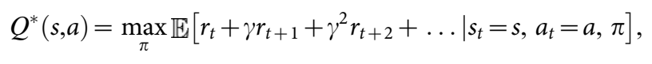
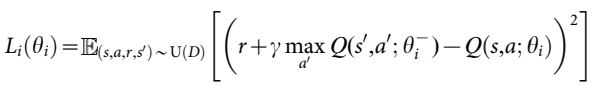

# Deep Q-network paper summary

## 1. 논문 정보
제목: Human-level control through deep reinforcement learning

저자: Volodymyr Mnih, Koray Kavukcuoglu, David Silver, Andrei A.Rusu, JeoVeness, Marc G.Bellemare, Alex Graves

## 2. Abstract 요약
실제 환경에서 강화학습을 성공적으로 적용하기 위해, Agent는 고차원의 sensory 입력으로부터 환경의 효율적인 표현을 추출하고 과거의 경험을 새로운 환경에 일반화해야 합니다.

강화학습 Agent는 다양한 분야에서 일부분 성공했지만, 적용 범위가 사람이 직접 설계할 수 있는 분야이거나 관측 가능한 저차원 상태 공간을 가지는 분야로 제한되었습니다.

이 논문은 Deep Neural Network의 최신 훈련 기법[a](https://www.nowpublishers.com/article/Details/MAL-006) [b](https://proceedings.neurips.cc/paper/2012/hash/c399862d3b9d6b76c8436e924a68c45b-Abstract.html) [c](https://www.science.org/doi/abs/10.1126/science.1127647)을 사용해서 Deep Q-network를 개발했습니다. 이 Agent는 고차원 sensory 입력으로부터 성공적인 정책을 직접 학습할 수 있고, 이를 end-to-end 강화학습 방식으로 수행합니다.

이 agent는 클래식 Atari 2600 게임에서 테스트되었고, 픽셀과 게임 점수만 입력 받은 상태에서 기존의 모든 알고리즘의 성능을 넘어섰습니다. 그리고 49개의 게임에서 전문 게임 테스트 수준에 도달하는 성과를 보여줬습니다. 

## 3. 문제 정의 및 동기

## 4. 핵심 아이디어

## 5. 방법론
### Preprocessing
Atari 2600의 프레임인 210x160 픽셀 이미지를 그대로 사용하면 연산 및 메모리 요구량이 커질 수 있어서, 다음과 같은 두 가지 전처리 과정을 수행했습니다.

단일 프레임을 인코딩할 때 현재 프레임과 이전 프레임의 각 픽셀 값 중 최대값을 선택합니다. 이를 통해 짝수 프레임에만 또는 홀수 프레임에만 나타나는 flickering 현상을 제거할 수 있습니다.

RGB 영상에서 Y 채널(휘도: luminance)를 추출한 뒤 84x84 크기로 rescale 합니다. algorithm1의 함수 φ는 이러한 전처리를 최근 m개 프레임에 적용하고 쌓아서 Q-function의 입력으로 사용합니다. 기본값은 m=4 입니다.

### Model Architecture

## 6. 실험 결과

## 7. 결론
이 연구는 하나의 아키텍처만으로도 최소한의 사전 지식을 바탕으로 픽셀과 게임 점수만 입력 받아 어려 환경에서 제어 정책을 성공적으로 학습할 수 있음을 확인했습니다. 그리고 알고리즘, 네트워크 아키텍처, 하이퍼파라미터를 모두 동일하게 사용했습니다.

이전 연구와 달리, 보상을 활용하여 Convolutional Network 내의 표현을 end-to-end 강화학습 방식으로 shaping 함으로써 value 추정에 중요한 환경의 salient feature를 학습하도록 했습니다. 이는 perceptual learning 중에 발생하는 보상 신호가 영장류 visual cortex 내의 표현의 특성에 영향을 줄 수 있다는 neurobiological 증거에 기반합니다. 

최근 경험된 상태 전이를 저장하고 표현하는 경험 재현(experience Replay) 알고리즘을 도입하여 강화학습과 Deep Network Architecture를 성공적으로 결합했습니다. 추후 경험 재현의 내용을 salient events에 편향시키는 방안을 탐구할 필요성이 있습니다.

이 연구는 SOTA Machine Learning Techniques와 Boilogically inspired mechanisms를 결합하여 다양한 도전 과제를 숙달할 수 있는 Agent를 만들어내는 가능성을 입증했습니다.

## 8. 느낀점

## 임시 정리
강화학습과 Deep Convolutional Network를 결합했습니다. DCN의 계층적 Conv Filter는 Receptive Field 효과를 모방하고, 이를 통해 이미지 내에 존재하는 Local 공간 상관관계를 활용하고 viewpoint나 scale의 변화와 같은 자연스러운 변형에 대한 강인성을 구축합니다.

강화학습 Agent를 개발할 때 우리는 관찰, 행동, 보상의 시퀀스에 대한 환경과 상호작용하는 과업을 고려했습니다. Agent의 목표는 미래 누적 보상을 극대화할 수 있는 방식으로 행동을 선택하는 것이니다. 최적의 action-value 함수 를 근사하기 위해 Deep Convolutional Network를 사용합니다.

eq1 수식은 각 시각 t에서 할인율(학습률) gamma를 적용한 보상 r_t의 최대 합이고, 상태 s를 관찰한 후 행동 a를 선택하는 정책인 pi = P(a|s)에 의해 달성됩니다.

강화학습은 nonlinear function approximator를 사용하여 action-value 함수(Q함수)를 표현할 때, 불안정하거나 수렴이 안되는 현상이 있습니다. 이에 대한 원인은 관찰 순서에 대한 상관관계, Q의 작은 업데이트가 정책을 변경시켜 데이터 분포가 바뀌거나, Q함수와 목표값 사이의 상관관계입니다.

위 3가지 원인을 해결하기 위해 새로운 Q-Learning의 변형을 제안합니다. 이에 대한 핵심 아이디어는 "경험 재현"과 "반복적 업데이트"입니다. 데이터를 무작위함으로써 관찰 시퀀스 내의 상관관계를 제거하고 데이터 분포 변화에 대한 smoothing을 얻습니다. 그리고 반복적 업데이트를 사용해서 Q함수를 주기적으로만 갱신되는 목표값에 맞춰서 조정함으로써 목표값과 상관관계를 줄입니다.

Deep Convolutional Neural Network를 통해 Q(s, a, theta)를 매개변수화 시킴으로써 네트워크를 처음부터 다시 학습시켜야 하는 문제를 해결했습니다.

경험 재현을 수행하기 위해, 각 시각 t마다 Agent의 경험 e를 e_t=(s_t, a_t, r_t, s_t+1) 형태로 만들어서 데이터셋 D_t={e_1,...,e_t}에 저장합니다. 학습을 할 때, 여기서 무작위로 샘플을 선택해서 Q-Learning을 수행합니다. Q-learning을 업데이트 할 때  손실 함수를 사용합니다. 이 때 gamma는 할인율(학습률)로 agent의 미래 horizon을 결정하고, theta_i는 현재 반복 단계 i에서의 Q-Network 파라미터이고, theta^-_i는 같은 반복 단계에서 target Network를 위한 파라미터입니다. 이 theta^-_i는 C 단계마다 한 번씩만 Q-network 파라미터 theta_i로 업데이트 되고, 이외에는 고정된 상태로 유지됩니다.

DQN Agent를 평가하기 위해, 사람에게도 어려운 다양한 과제를 제공하는 Atari 2600을 선택했습니다. 입력 데이터는 시각 적 이미지와 사용 가능한 행동 수만 제공하고, 각 행동이 어떤 의미를 가지는지는 제공하지 않았습니다. Agent의 에피소드당 점수 평균과 예측된 Q-value 평균 지표를 통해 강화학습 신호와 확률적 경사 하강법을 사용하여 큰 규모의 신경망을 안정적으로 학습시킬 수 있다는 것을 확인했습니다.

49개의 게임에 대해 이전의 강화학습 연구 SOTA 방법들과 Deep Q-Network를 비교했습니다. 그리고 통제된 조건에서 전문 사람 테스터 저뭇와 행동을 균등 무작위로 선택하는 정책의 점수(Extended Data Table2와 Figure3)도 표시했습니다.

DQN 방법은 Atari 2600 게임에 대한 추가적인 사전 지식 없이도 49개의 게임 중 43개의 게임에서 SOTA 강화학습 방법들의 성능을 넘어섰고, 전문 인간 데스터에 필적하는 성능을 보였으며 29개의 게임에서는 인간 점수의 75%를 초과하는 성과를 달성했습니다.(Figure3, Supplementary Discussion, Extended Data Table2)

추가적인 시뮬레이션(Extended Data Table3/4, Supplementary Discussion)에서 DQN은 핵심 구성 요소인 경험 재현( Experience Replay), 분리된 타켓 Q-network), Deep Convolutional Neural Network를 하나씩 비활성화하여 성능 저하 효과를 확인함으로써 이들 요소의 중요성을 입증했습니다.

