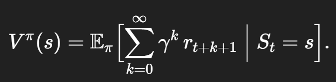
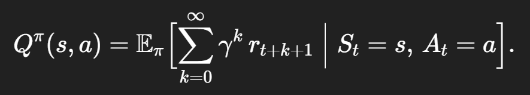
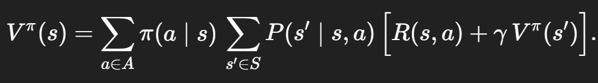

## 강화 학습이란?
강화학습은 머신러닝의 한 분야입니다.

강화학습은 지도학습과 다르게, 정답 데이터가 따로 주어지지 않습니다.

강화학습은 Agent가 특정 환경과 상호작용하면서 시행착오를 통해 학습하는 방식입니다. 사람이 새로운 것을 배우듯이, Agent는 행동을 했을 때 그에 대한 보상을 받으면 그 행동을 더 자주 하려 하고, 패널티를 받으면 그 행동을 피하려고 하면서 최적의 행동 전략을 찾아갑니다.

Agent란, 학습하고 행동하는 주체입니다.

환경이란, Agent가 상호작용하는 외부 세계입니다.

보상이란, Agent가 행동을 취한 결과에 따라 환경으로부터 받는 Scalar 값입니다. 이 보상 Scalar 값을 최대화 하는 방향으로 학습이 진행됩니다.

정책이란, 특정 상태에서 어떤 행동을 할지 결정하는 Agent의 전략입니다. 궁극적으로 강화학습은 이 정책을 최적화하는 것을 목표로 합니다.

상태란, Agent가 환경과 상호작용 하는 순간순간의 환경이 가진 정보 전체를 말합니다. 이 논문에서는 게임 화면 프레임 4장을 상태로 정의했습니다.

## Markov Decision Process, MDP)
MDP는 강화학습 문제를 수학적으로 모델링하기 위한 프레임워크 입니다. Agent가 환경과 상호작용하면서 최적의 행동을 결정하고 보상을 최대화하는 과정을 설명하는 데 사용됩니다.

MDP는 강화학습의 목표를 수학적으로 명확하게 정의하고 이를 해결하기 위한 다양한 알고리즘의 기반이 됩니다.

MDP의 핵심은 Markov Property 입니다. 

MDP는 상태공간 s, 행동공간 a, 전이확률 P, 보상함수 R, 할인율 gamma 를 정의하고 있습니다.

상태공간 s는 Agent가 처할 수 있는 모든 상황들의 집합입니다. 예를 들어 로봇 청소기의 경우, 방의 각 격자 위치와 배터리 잔량 단계등이 있습니다.

행동공간 a는 Agent가 각 상태 s에서 선택할 수 있는 모든 행동들의 집합입니다. 로봇 청소기는 한 칸 앞으로 이동, 좌회전, 충전기 위치로 이동 등이 있습니다.

전이 확률은 특정 상태 s에서 행동 a를 취했을 때 다음 상태 s'로 어떻게 변화될지에 대한 확률을 말합니다. 현실 세계에서 많은 환경은 우리가 원하는대로 동작하지 않습니다.

예를 들어 로봇에세 한 칸 앞으로 이동하라고 했을 때, 바닥의 마찰이나 센서 오차로 인해 정확히 한 칸 앞으로 못 갈 수도 있습니다. 전이 확률은 이러한 불확실성을 모델링하는 데 사용됩니다. 또한 환경이 너무 복잡해서 모든 세부적인 물리 법칙을 모델링하기 어려울 때 확률적 접근을 하는 것이 유용합니다.

보상함수는 상태 s에서 행동 a를 취했을 때 즉시 받는 보상을 수치로 나타낸 것입니다. 

할인률은 미래 보상의 현재 가치를 줄이기 위해 사용하는 계수이고, 0과 1 사이입니다. 0에 가까우면 즉시 보상에만 집중하고, 1에 가까우면 먼 미래의 보상도 즉시 보상과 동일하게 고려하겠다는 뜻입니다.

## Markov Property
마르코프 성질이란, 현재 상태만 알면 이전 모든 과거 상태들은 더 이상 미래에 대한 예측에 추가 정보가 되지 않는다는 기억 상실(memoryless) 특성입니다.

예를 들어, 체스 게임에서 다음 수를 결정할 때는 과거의 수를 모두 기억하는 것이 아니라 현재 체스판의 말 배치만 정확히 알면 되는 것입니다.

이 성질은 모델을 단순화시킬 수 있다는 장점이 있습니다. 하지만 실제 환경에서 Agent가 완전한 상태를 관찰하지 못하고 일부 정보만 얻는 경우 이 성질이 성립하지 않을 수 있고, 자연어 처리나 시계열 예측처럼 과거의 맥락이 중요할 때는 Transformer 구조가 필요할 수 있습니다.

## Bellman Equation
벨만 방정식은 최적성의 원리를 수학적으로 표현한 것입니다. 최적성의 원리란, 최적의 의사결정 문제는 더 작은 하위 문제들의 최적해를 통해 해결될 수 있다는 원리입니다.

현재 상태의 가치(value) = 지금 즉시 받는 보상 + 다음 상태에서 얻을 기대 가치(Value)

가치 함수(Value Function)은 특정 상태나 행동이 얼마나 좋은지 숫자로 나타내는 함수입니다. 가치 함수에는 상태 가치 함수와 행동 가치 함수가 있습니다.

상태 가치 함수는 상태 s에 있을 때 기대되는 누적 할인 보상으로,  수식입니다.

행동 가치 함수는 상태 s에서 행동 a를 취한 후 얻게 되는 기대 누적 할인 보상으로,  수식입니다.

이를 통해 bellman equation을 구하면,  입니다. 이 수식은 상태 s에서 모든 가능한 행동 a에 대해, 행동 선택 확률 pi(a|s)를 곱하고 해당 행동으로 s'에 도착할 확률 P(s' | s, a )를 곱한 뒤, 즉시 보상 R(s,a)와 다음 상태 value gammaV(s')의 합을 더해 모두 합산합니다.

## Exploration and Exploitation

## Model-Free and Model-Based

## Function Approximation

