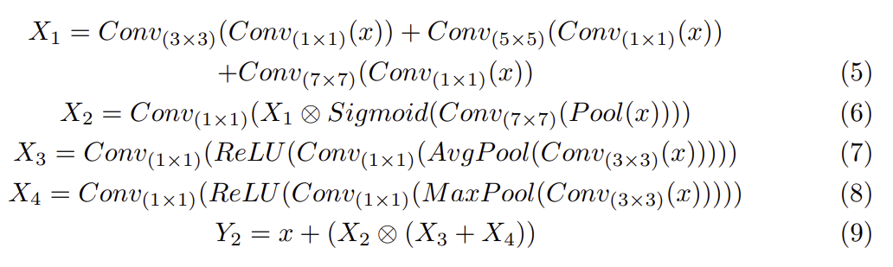

# ECMNet paper summary
## 논문 정보
제목: ECMNet:Lightweight Semantic Segmentation with Efficient CNN-Mamba Network

저자: 
## Abstract 요약
이 논문은 Efficient CNN-Mamba Network for Semantic Segmentation이라고 불리는 경량화된 네트워크를 제안합니다.

ECMNet은 Capsule-based Framework 내에서 CNN과 Mamba를 효과적으로 결합하여 이 둘의 상호 보완적인 약점을 해결합니다.

Enhanced Dual Attention Block (EDAB)를 설계했고, 특징 표현력 향상을 위해 Multi-Scale Attention Unit (MSAU)를 사용해서 다중 스케일 특징 통합과 공간적 통합과 채널 통합을 수행합니다.

Mamba 기반 특징 융합 모듈 (Feature Fusion Module)을 도입해서 다양한 수준의 특징을 효과적으로 융합함으로써 분할 정확도를 크게 향상시켰습니다.

## 문제 정의 및 동기
초기 Semantic Segmentation은 CNN을 사용했지만, CNN은 장거리 의존성을 포착하는 데 한계가 있었습니다.

이후에 나온 Transformer는 Semantic Segmentation에 효과적인 Global Context Modeling을 가능하게 했습니다. 이를 통해 전역 특징을 추출하고 복잡한 장면 데이터셋에서 기존의 CNN 모델들보다 뛰어난 성능을 보여줬습니다.

SegFormer는 Hierarchial Transformer Encoder와 경량 MLP Decoder를 결합해서 다중 스케일 특징 융합을 최적화했습니다. 그러나 Transfomrer는 연산 복잡도가 이미지 해상도의 제곱에 비례하기 때문에 고해상도 처리 시 연산 부담이 크고, 지역 정보에 대한 민감도가 부족하다는 한계가 있습니다.

위와 반대로 CNN 인코더와 Transformer 디코더를 결합한 모델들도 있었지만, 여전히 Self-Attention이 고해상도 이미지에서 장거리 시각 의존성을 처리할 때 속도와 메모리 사용량 측면에서 한게가 있었씁니다.

Mamba는 선형 복잡도의 효율적인 시퀀스 모델링을 통해 고해상도 이미지 처리에서 큰 가능성을 보여줬고, Vision Mamba는 다양한 컴퓨터비전 과업에서 뛰어난 성과를 입증했습니다.

게다가 제한된 계산 자원 및 모바일 디바이스에서 적용 가능한 Ligthweight Semantic Segmentatoin인 LEDNet, CFPNet, LETNet 등도 개발되었습니다.

위 두 방식인 Mamba와 Lightweight Semantic Segmenation을 기반으로 CNN-Mamba Hybrid Network인 ECMNet을 제안합니다.

## 핵심 아이디어
### U자형 CNN 인코더-디코더 구조 (Backbone)
이 구조를 통해 세부족인 공간 표현을 위한 Localized Features를 추출합니다.

### Feature Fusion Module (FFN) + SS2D Block
State Space Model (SSM)을 활용해서 복잡한 공간 정보와 장거리 의존성을 포착하고 Global Feature Representation 과 계산 복잡도를 최적화합니다.

### Enhanced Dual-Attention Block (EDAB)
서로 다른 수준의 특징 정보를 효과적으로 포착하면서 네트워크 파라미터 수를 최소화하도록 설계된 블록입니다.

### Multi-Scale Attention Unit (MSAU)
저수준 Spatial 정보와 고수준 Semantic 정보에 집중해서 더 높은 품질의 분할 결과를 생성합니다.

## 방법론

Figure1을 보면, CNN 인코더와 디코더는 EDAB로 개선된 모습이 보이고, 인코더와 디코더를 연결해주는 Mamba 기반의 Feature Fusion Mdoel이 보입니다.

그리고 3개의 Multi-Scale Attention Unit이 인코더와 디코더 사이에서 Long Skip Connection 역할을 담당합니다.

### 인코더 - 디코더
입력 특징은 1x1 Conv를 활용한 Bottleneck 구조를 통과해서 채널 수를 절반으로 줄입니다. 이를 통해 연산 복잡도와 파라미터 수를 크게 감소시킵니다.

1x1 Conv를 사용하지 않고, 3x1 과 1x3 Conv를 사용할 수도 있습니다. 이렇게 2개로 분리시켜두면 더 넓은 Recpetive Field를 확보하고 더 넓은 Contextual Feature를 포착할 수 있으며, 모델의 파라미터 수와 계산량도 타협할 수 있습니다.

EDAB는 2개의 결로를 가지고 있고, 각 경로는 Local 특징과 Global 특징을 포착합니다.

하나의 경로는 Decompose Convolution을 통해 Local이고 Short-distance 특징을 처리하며, 다른 하나의 경로는 Atrous Convolution을 통해 GLobal feature Integration을 수행합니다.

이 두 경로에 각각 Channel Attention 과 Dual-Direction Attention을 적용시켜서 다차원 특징 정보를 학습하고 특징 표현력을 향상시켰습니다. 

> ? 왜냐하면 상당수의 유용한 정보들은 채널 차원에 포함되고, 공간적 특징 정보는 성능향상과 잡은 간섭 억제에 핵심적인 역할을 하기 때문입니다.

최종적으로 두 경로의 출력과 중간 특징은 통합되어 1x1 Point-wise Conv를 통해 원래 차원으로 복원됩니다. 그리고 Channel Shuffle 전략을 적용해서 채널 간 상호 연관성을 형성하고 정보 단편화 문제를 해결합니다.

EDAB의 세부적 연산은 위와 같습니다. x는 EDAB의 입력, Y는 EDAB의 출력 특징맵, Conv_k*k()는 일반적인 k x k Conv 연산입니다. D는 Depth-wise Conv 이고, R은 Atrous Conv의 팽창 비율이고, CA는 Channel Attention이고, DDA는 Dual-Direction Attention이고, CS는 Channel Shuffle 입니다.

### Multi-Scale Attention Unit
Semantic Segmentation은 저수준의 공간정보와 고수준의 의미 정보를 결합하는 것이 효율적입니다. 이에 U-Net의 구조를 참고해서 고수준 특징맵과 저수준 특징맵을 Same-Resolution Connections를 사용해서 통합합니다.

3개의 MSAU를 사용해서 장거리 연결을 했습니다. 하나의 MSAU는 2개의 경로로 구성되는데, Multi-Scale Spatial Aggregation 과 Channel Aggregation 으로 구성됩니다.

MSAU는 Multi-Scale Spatial Aggretation과 Channel Aggregation의 출력들을 곱하고 이를 원래 입력 특징맵에 더해서 최종 출력 특징맵을 생성합니다. 이를 통해 저수준 공간 정보와 고수준 의미 정보를 효과적으로 융합하고 특징 표현력을 향상시킵니다.

위 eq2에서, x는 MSAU의 입력, Y는 MSAU의 출력 특징맵, Conv_kxk()는 k x k Conv 연산입니다. ⊗ 는 Element-wise Multiplication이고, Pool()은 Adaptive Average Pooling, AvgPool()은 Average Pooling, MaxPool()은 Maximum Pooling, ReLU()는 Recified Linear Unit, Sigmoid()는 Sigmoid 활성화 함수를 의미합니다.

#### Multi-Scale Spatial Aggretation
Multi-Scale Spatial Aggregation은 1x1 Conv를 사용해서 입력 특징 맵의 C 채널을 C/2 채널로 변환합니다. 이를 통해 파라미터 수와 계산량을 줄이는 동시에 Multi-Scale Feature Extraction을 유지합니다.

그 다음에 3x3, 5x5, 7x7 크기의 Depth-spearable Conv를 통과시켜서 Multi-Scale 특징 정보를 얻고, 이를 통해 Multi-Scale Percption을 강화합니다.

이렇게 만들어진 7x7 특징 맵은 Adaptive Average Pooling을 통과해서 세로 차원을 1로 압축합니다.
그리고 아까 만들어둔 7x7 특징맵에 1x1 Conv를 적용시킨 뒤 sigmoid 활성화 함수를 거쳐서 Spatial Attention Map을 생성합니다.

이렇게 생성된 Spatial Attenton Map을 세로 차원이 1로 압축된 특징맵에 곱합니다. 이를 통해 중요한 공간 영역을 강조하고 불필요한 정보를 억제합니다.

그리고 마지막으로 1x1 Conv를 사용하여 채널 수를 C/2 에서 C로 복구시킵니다. 이렇게 만들어진 Attention Map은 특징맵의 위치에 대한 중요도를 반영합니다.

#### Channel Aggregation
입력 특징 맵에 Average Pooling과 Maximum Pooling을 각각 적용시키고, 이에 대한 평균 및 최대 채널 특징 맵을 얻은 뒤 이 두 특징맵을 통해 다양한 관점에서의 Channel Statistics를 포착합니다.

### Feature Fusion Model
Mamba를 기반으로 Feature Fusion Model을 설계했고, 2D-Selective-Scan(SS2D)를 사용해서 Global 표현을 더 적은 네트워크 파라미터와 계산량으로 효과적으로 포착했습니다.

FFM은 MSAU와 인코더로부터 Multi-Level 특징 정보를 Concatenate 연산을 통해 통합합니다. 이를 통해 Feature Diversity를 풍부하게 합니다.

그 다음에 SS2D 블록은 일련의 선형 변환과 2D Conv 연산을 통해 특징을 추가적으로 추출하고 융합합니다. 이를 과정에서 Selective Scanning Mechanism을 적용시켜서 특징 표현력을 향상시킵니다.

마지막에는 Feed-Forward Network로 비선형 변환을 수행하고, 특징의 가중치 분포를 조정함으로써 핵심 특징은 강조하고 중복 정보는 억제합니다. 이를 통해 복잡한 작업을 효과적으로 처리하게 됩니다.

이렇게 설계된 FFN은 다중 스케일 특징을 효과적으로 융합하고 Local Detail 정보와 Overall Semantic 특징을 동시에 포착합니다. 이를 통해 Semantic Segmentation 작업에서 모델의 성능을 향상시킬 수 있습니다.

위 수식에서 x_encoder, x_MSAU1, x_MSAU2는 각 인코더와 MSAS의 출력을 의미합니다. Y는 FFM의 출력 특징맵, Concat()은 Concatenation Operation, SS2D()는 2D-selective-scan 블록, FFN()은 Feed-forward Network를 의미합니다. 

## 실험 결과
Cityscapes 데이터셋과 CamVid 데이터셋을 사용했습니다.

### Ablation Experiments

Long Skip Connections를 하나씩 추가하면서 영향을 관찰한 결과, 얕은 계층 정보인 Line1(Low-level)이 0.61% 성능향상을 보여서, Semantic Feature Reconstruction에 효과적으로 기여한다는 것을 확인했습니다. 3개의 Long Skip Connections를 모두 사용하면 1.29%의 mIoU 향상이 나타났고, 이 3개의 line들이 Semantic Segmentation에서 중요한 역할을 한다고 확인했습니다.

Long Skip Connections에 MSAU 모듈을 추가해서 성능 변화를 관찰한 결과, line1만 사용했을 때 보다 line1에 MSAU를 같이 사용한 것이 mIoU를 더 향상시켰습니다. (mIoU 0.62% vs 0.92%) 하지만 MSAU를 추가함으로 인해 9.43K의 파라미터가 증가했습니다.

Line1에 MSAU를 같이 사용하고 FFM까지 도입하게 되면 mIoU가 1.11% 향상되었습니다. (mIoU 0.62% vs 0.92% vs 1.11%) 3개의 line과 3개의 MSAU와 1개의 FFM을 사용할 경우 최종적으로 3.7%의 mIoU 향상을 확인했습니다.

## 결론

## 느낀점

