# EfficientDet paper Summary
## 1. 논문 정보
제목: EfficientDet: Scalable and Efficient Object Detection

저자: Mingxing Tan, Ruoming Pang, Quoc V. Le

## 2. Abstract 요약
객체 탐지를 위해 EfficientNet을 기반으로 EfficientDet을 개발했고, 다음의 최적화 기법을 사용했습니다. 우선, weighted bi-directional feature pyramid network (BiFPN)을 사용해서 빠르고 쉬운 다중 스케일 특징 융합을 가능하게 합니다. resolution, depth, width를 Backbone, Feature Network, Box/Class Prediction Network 전체에 균일하게 확장하는 Compound Scaling 방법을 사용합니다. 이를 통해 다양한 자원 제약 환경에서도 기존의 기법보다 우수한 효율성을 달성했고, 단일 모델 및 스케일 설정에서 EfficientDet-D7은 COCO test-dev 에서 State-of-the-Art를 달성했습니다.

## 3. 문제 정의 및 동기
기존의 State-of-the-Art Detection 모델들은 자원을 많이 사용하면서 높은 정확도를 달성해, 로봇공학이나 낮은 레이턴시를 요구하는 환경에서 사용하기에 어렵습니다. one-stage, anchor-free-detectors, compress model 기법들은 더 나은 효율성을 달성하지만 동시에 정확도를 낮춥니다. 또한 대부분의 연구들은 특정되고 제한된 범위의 자원 요구사항에만 초점을 맞추고 있어서, 실제 환경인 모바일 장치부터 데이터센터까지의 다양한 자원 제약을 고려해야 합니다.

## 4. 핵심 아이디어
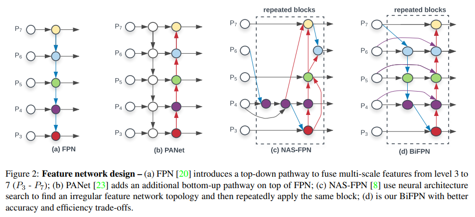

기존의 연구들은 서로 다른 스케일의 특징을 융합하기 위해, 서로 다른 해상도의 입력 특징들을 단순히 더했습니다. 이는 각 특징이 융합된 출력에 기여하는 비중이 동등하지 않다는 것을 고려하지 않았기 때문에, 이 논문은 weighted bi-directional feature pyramid network (BiFPN)을 제안합니다. BiFPN은 학습 가능한 가중치를 도입하여 각 입력 특징의 중요도를 학습하고, top-down과 botton-up 방식의 다중 스케일 특징 융합을 반복적으로 수행합니다. 즉, 양방향 경로와 fast normalized fusion을 결합해서 서로 다른 해상도를 갖는 특징맵을 더 정교하게 융합합니다. BiFPN은 위의 Figure2(d)의 구조를 가지고 있고, 수식은 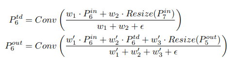 입니다.

Object detection을 위한 compound scaling 기법을 통해, resolution, depth, width를 backbone, feature network, box/class prediction network 전체에 걸쳐서 확장합니다.

one-stage detector design은 two-stage detector design 보다 정확도는 낮지만 단순하고 효율적입니다. 이 논문은 주로 one-stage detector design을 사용하면서 효율성과 높은 정확도를 달성함을 보여줍니다.

## 5. 방법론
아래 Figure3는 EfficientDet의 전체 아키텍처를 보여주고, 이 그림에서 EfficientDet이 one-stage detectors 패러다임을 따르는 것을 볼 수 있습니다. EfficientDet은 ImageNet으로 사전학습된 EfficientNet을 Backbone 네트워크로 사용하고 있고, level 3 ~ levle 7의 특징들을 입력받아 top-down과 botton-up의 양방향 특징 융합을 반복적으로 수행하는 BiFPN가 feature network 역할을 합니다. 여기서 융합된 특징들은 class/box prediction Network에 입력되어 객체 클래스와 bounding box 예측을 제공합니다.

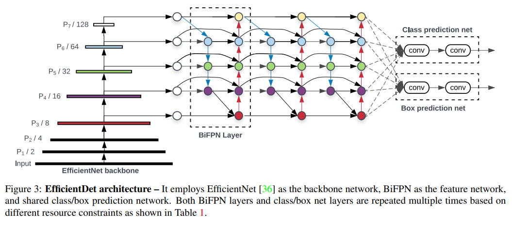

Compound Scaling의 single compound coefficient를 사용해서 Backbone 네트워크, class/box prediction 네트워크, 해상도를 동시에 확장합니다. Backbone 네트워크로는 EfficientNet B0 ~ B6를 사용했습니다.

BiFPN 네트워크의 depth는 작은 정수이어야 함으로, 선형적으로 증가시켰습니다. width는 grid search를 사용해서 {1.2, 1.25, 1.3, 1.35, 1.4, 1.45} 중 1.35가 성능이 제일 좋음을 확인했고, 이를 통해 width와 depth를 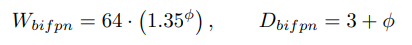 로 확장시켰습니다.

Class/Box Prediction 네트워크에서, depth는 BiFPN과 동일하게 고정시켰지만 depth는 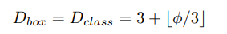 를 사용해서 선형적으로 증가시켰습니다.

BiFPN에서 feature level 3~7이 사용되기 때문에 입력 해상도는 2의 7승인 128로 나누어 떨어지는 값이어야 합니다. BiFPN에서 feature level 3 ~7을 모두 사용하려면 입력 이미지를 다운샘플링했을 때 정수 크기의 특징맵이 나와야 하고, level L의 특징은 원본 해상도를 2의 L승으로 나눈 크기입니다. 여기서 level 7의 정수 분할이 보장되면 level 3 ~ 6에서도 모두 정수 분할이 되기 때문에 입력 해상도는 128로 나누어 떨어지는 값이어야 합니다. 따라서 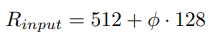 를 사용해서 선형적으로 해상도를 증가시킵니다.

compound coefficient를 0부터 7까지 위 식들에 적용시키면 Table1에서 볼 수 있는 여러 EfficientDet 모델들을 만들 수 있습니다. Table1에서 D6가 2번 보이는데, compound coefficient가 7인 D6는 comopund coefficient가 6인 D6에 해상도만 더 높은 모델입니다.

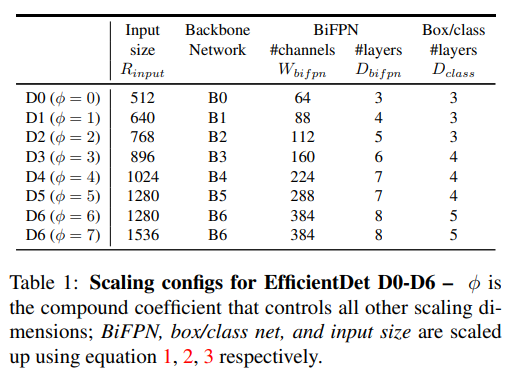

EfficientDet의 각 모델들은 SGD Optimizer로 학습되었고, Momentum = 0.9, weight decay = 4e-5로 설정되었습니다. Learning Rate는 첫 번째 epoch 안에서 0부터 0.16까지 선형적으로 증가시킨 뒤, Cosine Decay 규칙을 사용하여 감소시켰습니다. 모든 Convolution 이후에 synchronized batch normalization을 적용하고, 이 batch normalization의 decay = 0.99, epsilon = 1e-3 으로 설정했습니다. 또한 switch activation과 exponential moving average를 사용하고, exponential moving average의 decay = 0.9998을 사용했습니다. Focal Loss를 사용했고, Focal Loss의 alpha = 0.25, gamma = 1.5, aspect ratio {1/2, 1, 2}를 사용했습니다.

## 6. 실험 결과
Table2는 single model 및 single scale 설정에서 test-time augmentation 없이 EfficientDet과 기존의 객체 탐지 모델들을 비교한 것입니다.

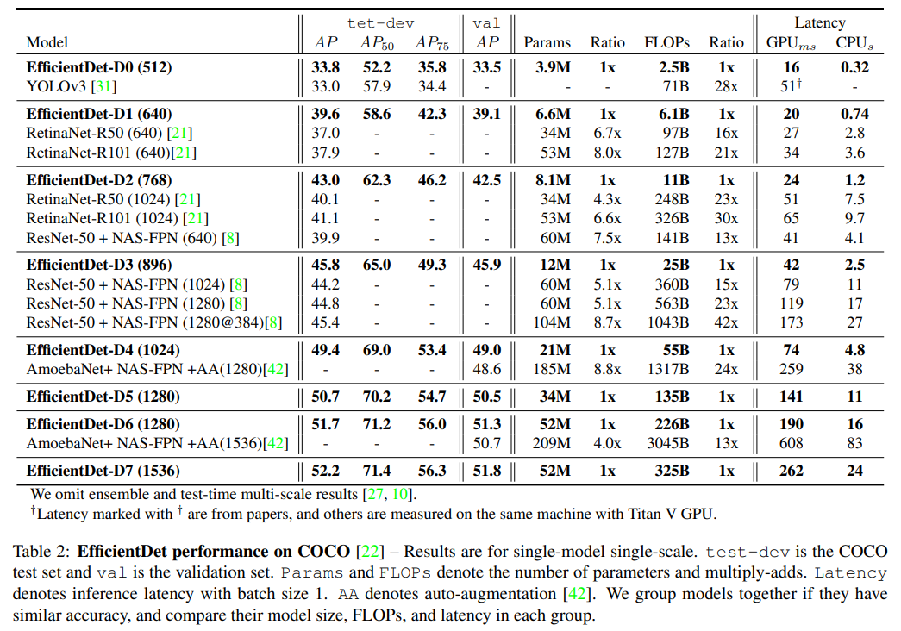

Figure4는 모델의 크기, GPU 지연시간, single-thread CPU 지연 시간에 대한 비교를 보여줍니다.

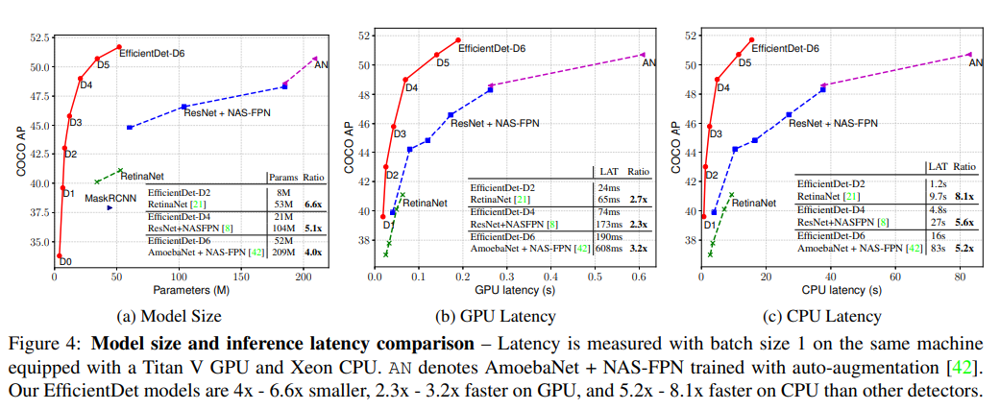

Sementic Segmentation 과제에서도 EfficientDet이 잘 작동하는지 확인하기 위해, BiFPN의 P2 ~ P7 수준의 특징들을 유지하고 최종 픽셀 분류에서 P2만 사용하도록 모델을 수정했고 아래 Table3는 EfficientDet-D4 모델과 기존의 DeepLabV3+, Pascal VOC 2012와 비교한 표입니다.

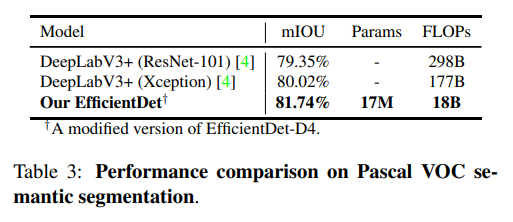

Ablation Study를 통해, EfficientNet Backbone과 BiFPN이 최종 모델의 성능에 핵심적인 요소임을 Table4를 통해 확인했습니다. Table5를 보면 BiFPN이 다른 네트워크들 보다 적은 파라미터 수와 FLOPS를 사용하면서도 유사한 정확도를 달성함을 확인할 수 있었습니다. 그리고 Table6를 보면 fast normalized feature fusion 방식과 softmax 기반 방식을 비교한 것을 볼 수 있습니다.

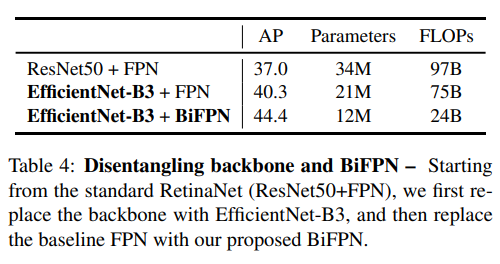
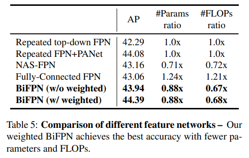
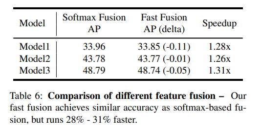

## 7. 결론
이 논문은 효율적인 객체탐지와 정확도 및 효율성 향상을 위해서, network architecture desing choices를 분석하고 weighted bi-directional feature network와 compound scaling 기법을 제안합니다. 이를 통해 EfficientDet이라는 새로운 모델을 만들었고, 다양한 자원 제약 상황에서 기존 기법들보다 더 일관된 정확도 및 효율성을 달성했습니다. 스케일된 EfficientDet은 이전의 객체 탐지 및 의미론적 분한 모델들보다 훨씬 적은 파라미터 수와 FLOPS를 달성해서 State-of-the-Art 정확도를 달성했습니다.

## 8. 느낀점
EfficientNet에서 EfficientDet으로 Vision Task를 변경하는 것은 간단하지 않다는 것을 느꼈습니다. 그리고 Detection이 목표인 모델에서 Segmentation의 성능도 준수한 것을 보아, 하나의 목표 모델이 다른 목표에 부합될 수도 있다는 것을 알았습니다.
