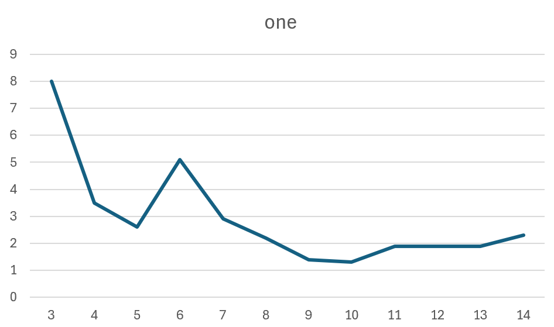
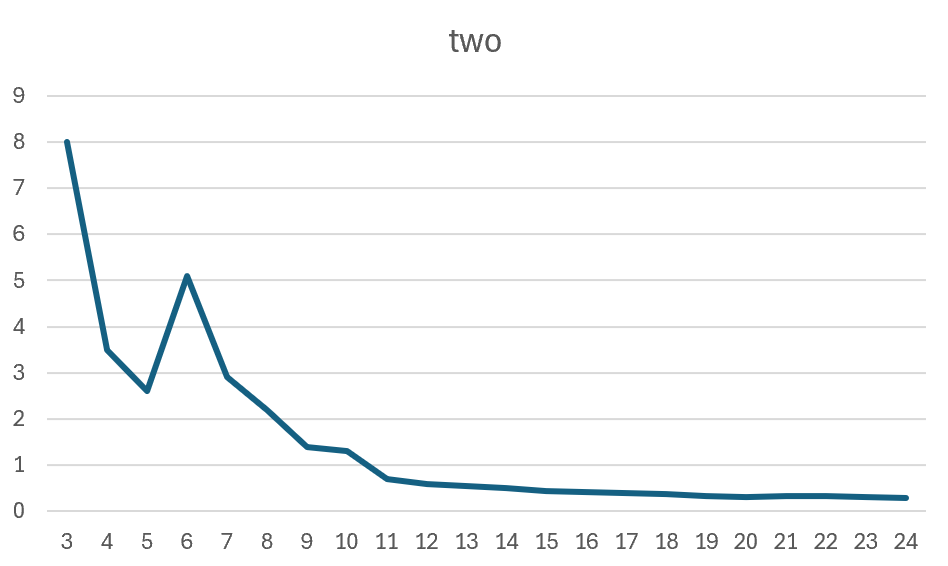

# 논문을 읽고 Pytorch로 코드 작성해보기

## 성능 최적화
직접 만든 코드에서 최적의 배치 사이즈를 찾기 위해, 4, 8, 10 순서대로 늘려서 8GB VRAM에서 배치사이즈가 10일때 메모리를 최대로 활용한다는 것을 확인했습니다.

총 14 Epoch를 돌렸고, Validation은 25 -> 117 -> 8 -> 3.5 -> 2.6 -> 5.1 -> 2.9 -> 2.2 -> 1.4 -> 1.3 -> 1.9 -> 1.9 -> 1.9 -> 2.3 으로 나왔습니다.



처음에는 Validation Loss가 점점 줄어들다가 후반에 갈 수록 오히려 올라가는 모습을 보입니다.

이에 다음과 같은 과정을 진행하고자 합니다.

1. ReduceLROnPlateau 스케줄러를 사용하여 검증 손실이 정체될 때 자동으로 학습률을 낮추기
2. 옵티마이저에 weight decay를 추가하여 모델의 가중치가 너무 커지지 않도록 규제하기
3. 데이터 증강하기


1번과 2번 방법까지 진행했을 때는 눈에 띄게 Validation Loss가 줄어들지 않았습니다. object detection에서는 증강을 할 때 Albumentations로 진행합니다. 따라서 훈련 데이터만을 Albumentations로 증강시켰더니 Training Loss와 Validation Loss가 매 Epoch마다 줄어들기 시작했습니다.

최저 loss인 10 epoch부터 다시 훈련을 시작해서,



처럼 더 내려가기 시작했습니다.
하지만 0.3 근처에서 더 이상 진전되지 않는 모습을 보이고 있습니다.

## 코드 작성
> we use swish activation

논문에서는 swish activation을 사용했다고 적혀 있습니다. 따라서 Swish Activation을 구현합니다.
```
class Swish(nn.Module):
    def forward(self, x):
        return x * torch.sigmoid(x)
```
>  we use depthwise separable convolution [5, 34] for feature fusion, and add batch normalization and activation after each convolution.

논문에서 Depthwise Separable convolution을 사용했다고 적혀 있습니다. 따라서 nn.Module을 상속 받아서 커스텀 레이어를 만듭니다.
```
class SeparableConvBlock(nn.Module):
    def __init__(self, in_channels, out_channels, kernel_size = 3, stride = 1, padding = 1):
        super().__init__()
        self.depthwise_conv = nn.Conv2d(in_channels, in_channels, kernel_size, stride, padding, groups=in_channels, bias = False)
        self.pointwise_conv = nn.Conv2d(in_channels, out_channels, kernel_size = 1, stride = 1, padding = 0, bias = True)
        self.bn = nn.BatchNorm2d(out_channels, momentum = 0.01, eps = 1e-3)
        self.swish = Swish()

    def forward(self, x):
        x = self.depthwise_conv(x)
        x = self.pointwise_conv(x)
        x = self.bn(x)
        x = self.swish(x)
        return x
```

이제 BiFPN 층을 구현해야 합니다.
myMain.py의 Line-36을 보면 BiFPNLayer 클래스가 있습니다.
이 코드의 init 부분에는 
```
self.w1 = nn.Parameter(torch.ones(2, dtype = torch.float32), requires_grad = True)
self.w1_relu = nn.ReLU()
self.w5 = nn.Parameter(torch.ones(3, dtype=torch.float32), requires_grad=True)
self.w5_relu = nn.ReLU()
```
처럼 Top-Down에 사용할 가중치를 크기가 2인 텐서로 선언하고, Bottom-Up에 사용할 가중치를 크기가 3인 텐서로 선언했습니다.
수식의 w1과 w2는 w1[0], w1[1]로 코드에서 구현됩니다. 그리고 w'1과 w'2와 w'3는 w5[0], w5[1], w5[2]로 코드에서 구현됩니다.

그리고 init 부분에는 서로 다른 해상도의 특징맵을 합치기 위해 위에서 정의한 SeparableConvBlock을 가져옵니다.
```
self.conv_up = nn.ModuleList([SeparableConvBlock(num_channels, num_channels) for _ in range(4)])
self.conv_down = nn.ModuleList([SeparableConvBlock(num_channels, num_channels) for _ in range(4)])
```

아래 코드로 수식의 P6_td 와 P4_out 을 구현할 수 있습니다.
```
w1 = self.w1_relu(self.w1)
w1 = w1 / (torch.sum(w1, dim = 0) + self.epsilon)
P6_td = self.conv_up[0](w1[0] * P6_in + w1[1] * self.upsample(P7_in))

w5 = self.w5_relu(self.w5)
w5 = w5 / (torch.sum(w5, dim=0) + self.epsilon)
P4_out = self.conv_down[0](w5[0] * P4_in + w5[1] * P4_td + w5[2] * self.downsample(P3_out))
```

이제 BiFPN 클래스를 구현해야 합니다. 이 클래스는 Backbone에서 특징맵을 입력 받아 BiFPNLayer를 통해 EfficientDet을 구현합니다.
BiFPN 내부에서 특징맵이 가질 채널의 개수를 num_channels로 입력 받고, BiFPNLyaer를 몇 번 쌓을지 num_repeats로 입력 받고, backboe_out_channels는 backbone에서 나오는 특징맵들의 채널 개수 리스트를 입력 받습니다.
```
def __init__(self, num_channels, num_repeats, backbone_out_channels):
```

아래 코드를 통해 backbone의 출력을 BiFPN이 처리할 수 있는 형태로 맞춰줍니다. backbone에서 나온 특징맵들의 채널 수를 num_channels(논문을 보면 D0는 64 채널수 입니다.)로 통일시켜주는 역할을 in_convs가 합니다.
```
for out_channels in backbone_out_channels:
    self.in_convs.append(
        nn.Sequential(
        nn.Conv2d(out_channels, num_channels, kernel_size = 1, stride = 1, padding = 0), 
        nn.BatchNorm2d(num_channels, momentum = 0.01, eps = 1e-3)
        )
    )
```

Backbone에는 P6와 P7이 없기 때문에 backbone의 원본 출력을 가지고 P6를 만들고, P6를 가지고 P7을 만듭니다.
따라서 P6는 backbone의 마지막 출력 값인 backbone_out_channels[-1] 사용하고, P7은 P6의 채널 수인 num_channels를 사용합니다.
```
self.p6_conv = nn.Sequential(
    nn.Conv2d(backbone_out_channels[-1], num_channels, kernel_size=1, stride=1, padding=0),
    nn.BatchNorm2d(num_channels, momentum=0.01, eps=1e-3)
)
self.p7_conv = nn.Sequential(
    nn.Conv2d(num_channels, num_channels, kernel_size=1, stride=1, padding=0),
    nn.BatchNorm2d(num_channels, momentum=0.01, eps=1e-3)
)
```

아래 코드를 통해 층의 반복을 구현합니다.
```
self.bifpn_layers = nn.ModuleList([BiFPNLayer(num_channels) for _ in range(num_repeats)])
```

최종 박스 예측과 클래스 예측을 수행하기 위해 아래 클래스를 사용합니다.
```
class BoxNet(nn.Module):
class ClassNet(nn.Module):
```

그리고 EfficientDet 과 EfficientNetBackbone을 구현하는 클래스도 만들어줍니다.
```
class EfficientDet(nn.Module):
class EfficientNetBackbone(nn.Module):
```

KITTI 데이터셋을 사용하기 위한 클래스도 만듭니다.
```
class KittiDataset(Dataset):
```

EfficientDet의 One-Stage Object Detector를 구현하기 위해 Anchors 클래스와 FocalLoss 클래스를 구현해줍니다.
Anchors 클래스는 모델이 예측을 수행할 기준점이 되는 박스들을 생성합니다. 즉, anchor를 생성합니다.
One-Stage Detector는 다양한 크기와 비율을 가진 Anchor 박스들을 미리 정의하고, Box Regression과 Class Classification을 예측합니다.

FocalLoss 클래스는 One-Stage Detector의 문제점인 클래스 불균형 문제를 해결하는 손실 함수입니다.
이 논문에는 Focal Loss를 사용하고 하이퍼 파라미터를 alpha=0.25, gamma=1.5로 설정했습니다.
```
class Anchors(nn.Module):
class FocalLoss(nn.Module):
```


