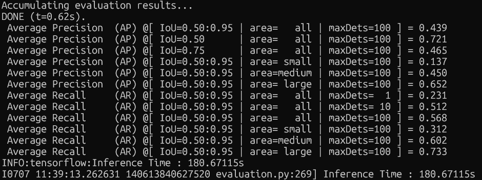
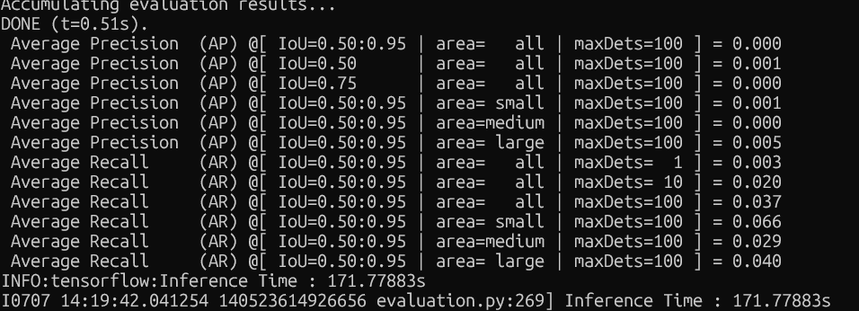

# EfficientDet 모델을 Fine-tuning 하기
## DataSet
KITTI 2D 데이터셋을 다운 받았습니다.
12gb 용량이고, 왼쪽 카메라 학습 이미지 (training/image_2)와 라벨 (training/label_2)를 받았습니다.

TFRecord 변환을 했습니다.
EfficientDet 코드가 TFRecord 포멧만 지원하기 때문에, create_kitti_tf_record.py 스크립트를 통해 .png + .txt 를 *.record로 변환했습니다.

## 문제 발생
### 데이터 변환 문제
TFRecord 변환 스크립트 내부에서 from object_detection.utils import dataset_util를 사용하는데, TensorFlow-Models Object Detection API가 설치되어 있지 않아서, git clone https://github.com/tensorflow/models.git 를 통해 model/research 를 다운받았습니다.

하지만 PYTHONPATH 설정을 실패했고, .bashrc와 activate.d 설정 값도 실패를 해서, create_kitti_tf_record.py 최상단에 다음과 같은 코드를 추가했습니다.
```
import sys, os
ROOT = os.path.dirname(os.path.abspath(__file__))
sys.path.insert(0, os.path.join(ROOT, 'models', 'research'))
sys.path.insert(0, os.path.join(ROOT, 'models', 'research', 'slim'))
```

이 코드는 스크립트가 실행되는 순간, models/research 와 models/research/slim 디렉터리를 파이썬 모듈 검색 경로(sys.path)로 추가하게 됩니다.

### OOM 문제 (Out Of Memory)
OOM 문제가 발생해서, batch_size를 4로 낮췄습니다.
d4 모델에서 Batch Size를 4 -> 2 -> 1로 낮춰서 fine-tuning을 시도했으나 OOM 문제가 발생하였습니다.
이에 d2 모델로 낮추고 배치 사이즈도 2로 설정했습니다.

### Box_loss 계산 불가능 문제
fin-tuning을 진행했더니 box_loss가 0으로 고정되는 문제가 발생했습니다. 그래서 이를 확인하는 코드(inspect_tfrecord.py)를 실행했더니, efficientdet은 박스 좌표가 [0.0,1.0] 범위로 정규화되어 있어야 하는데 제가 사용한 방법은 px 단위로 박스 위치가 되어 있어서 손실 값이 0으로 고정되는 현상이 발생했습니다.

따라서 create_kitti_tf_record.py 내부에 코드 중 width와 height로 나눠서 0,1 범위로 변환하고자 합니다.

### Fine-tuning 결과

fine-tuning 첫 1000 step의 경우 loss=0.25, box_loss=0.001, cls_loss=0.1, det_loss=0.15 수준이었지만, 2000 ~ 4000 step 사이에서는 loss 값이 증가하는 현상을 확인했습니다.

하지만 5000 step 부터는 loss 값이 감소하는 것을 확인했습니다. 그러다가 9000 ~ 1000 step에서 증가 후, 11000 step에서 한 번 최저 loss 값을 달성하고 다시 증가하는 모양이 보입니다.
```
2000 step은 l=0.46, b_l=0.003, c_l=0.18, d_l=0.3 
3000 step은 l=0.38, b_l=0.002, c_l=0.17, d_l=0.29 
4000 step은 l=0.77 b_l=0.005, c_l=0.30, d_l=0.56 
5000 step은 l=0.46, b_l=0.002, c_l=0.25, d_l=0.36
6000 step은 l=0.40, b_l=0.0019, c_l=0.21, d_l=0.3
7000 step은 l=0.30, b_l=0.0016, c_l=0.17, d_l=0.25
8000 step은 l=0.30, b_l=0.0010, c_l=0.15, d_l=0.20
9000 step은 l=0.46, b_l=0.003, c_l=0.2, d_l=0.36
10,000 step은 l=0.45, b_l=0.0028, c_l=0.21, d_l=0.36
11,000 step은 l=0.28, b_l=0.0016, c_l=0.10, d_l=0.18
12,000 step은 l=0.35, b_l=0.0022, c_l=0.14, d_l=0.25
13,000 step은 l=0,51, b_l=0.0034, c_l=0.24, d_l=0.417
14,000 step은 l=0.51, b_l=0.0036, c_l=0.23, d_l=0.413
15,000 step은 l=0.46, b_l=0.0018, c_l=0.26, d_l=0.36
16,000 step은 l=0.28, b_l=0.0008, c_l=0.139, d_l=0.183
17,000 step은 l=0.32, b_l=0.0010, c_l=0.177, d_l=0.228
```
Fine-tuning


Zero-shot

첨부된 두 이미지를 보면, COCO로만 학습된 D2 모델을 그대로 KITTI에 적용하니, 모든 지표가 0에 근접했습니다.
제가 16,000 step으로 fine-tuning한 D2 모델은 AP 0.43, AP50 0.72, AP 75 0.46을 달성했습니다.

### 과적합 원인 추정
fine-tuning은 zero-shot에 비해 효과적이었으나, 과적합이나 불안정한 학습이 있음을 확인했습니다.
GPU VRAM의 용량 한계로 인해 배치사이즈를 2로 선택한 것이, BatchNorm이 매 스텝마다 미니배치로부터 계산하는 평균과 분산이 배치마다 크게 변동한다면 해당 구간에서 gradient가 불안정해져서 손실 급등이 발생했을 가능성이 있습니다. 배치 크기가 2이기 때문에 서로 다른 두 이미지가 매 스탭마다 모델에 동시에 들어가고, 이를 통해 계산된 평균과 분산으로 배치정규화를 수행합니다.

KITTI 데이터셋은 샘플 수가 많지 않고 장면마다 특징이 달라서, 일정 step마다 미니배치 구성이 달라지면 loss가 요동칠 가능성도 있습니다.

그리고 모델이 가진 표현력에 비해 fine-tuning 데이터가 한계게 도달해 추가 학습에도 큰 개선 여지가 없을 수도 있습니다.

Learning Rate 스케줄을 Cosine Decay 대신에 Step decay나 cosine with restart를 사용해볼 수 있습니다.

Fine-tuning시 batch normalization을 frozen 모드 (is_training_bn=False)로 둘 수도 있습니다.

그리고 데이터셋의 부족으로 인해 과적합이 됐을 수도 있습니다. 따라서 증강 기법을 사용하여 학습 데이터셋을 늘리는 방법도 있습니다.

## 논문의 main.py에서 fine-tuning 진행하는 명령어

Train 데이터셋을 tfrecord로 변환하기
```
python create_kitti_tf_record.py --kitti_root=./KIT/ --output_path=./finTfrecords/train.record --label_map_path=./label_map.txt --subset=training
```

Validation 데이터셋을 tfrecord로 변환하기
```
python create_kitti_tf_record.py --kitti_root=./KIT/ --output_path=./finTfrecords/val.record --label_map_path=./label_map.txt --subset=validation
```

텐서보드로 결과 확인하기
```
tensorboard --logdir=./savedmodel/exp_kitti_d0
```

학습+평가시키기
```
python main.py \
  --mode=train_and_eval \
  --model_name=efficientdet-d0 \
  --train_file_pattern=./finTfrecords/train.record \
  --val_file_pattern=./finTfrecords/val.record \
  --model_dir=./savedmodel/exp_kitti_d1/ \
  --ckpt=./efficientdet-d0/model \
  --train_batch_size=4 \
  --eval_batch_size=2 \
  --num_epochs=5 \
```

  평가만 하기
  ```
python main.py \
  --mode=eval \
  --model_name=efficientdet-d0 \
  --val_file_pattern=./finTfrecords/val.record \
  --model_dir=./savedmodel/exp_kitti_d1/ \
  --eval_batch_size=2
```

중단된 체크포인트부터 학습
```
python main.py \
  --mode=train_and_eval \
  --model_name=efficientdet-d0 \
  --train_file_pattern=./finTfrecords/train.record \
  --val_file_pattern=./finTfrecords/val.record \
  --model_dir=./savedmodel/exp_kitti_d0/ \
  --train_batch_size=4 \
  --eval_batch_size=2 \
  --num_epochs=10 \
  --num_examples_per_epoch=5985 \
```
