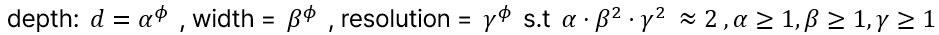
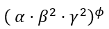
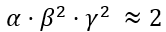
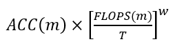
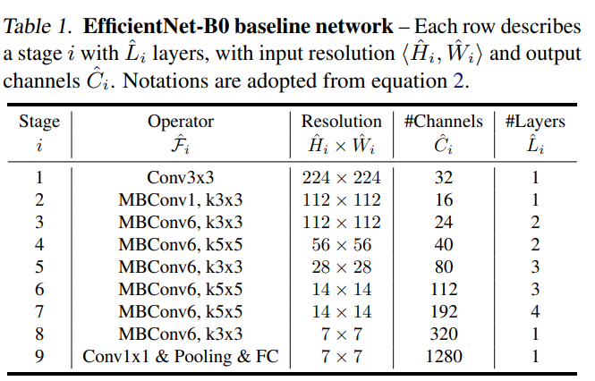
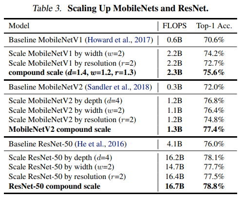
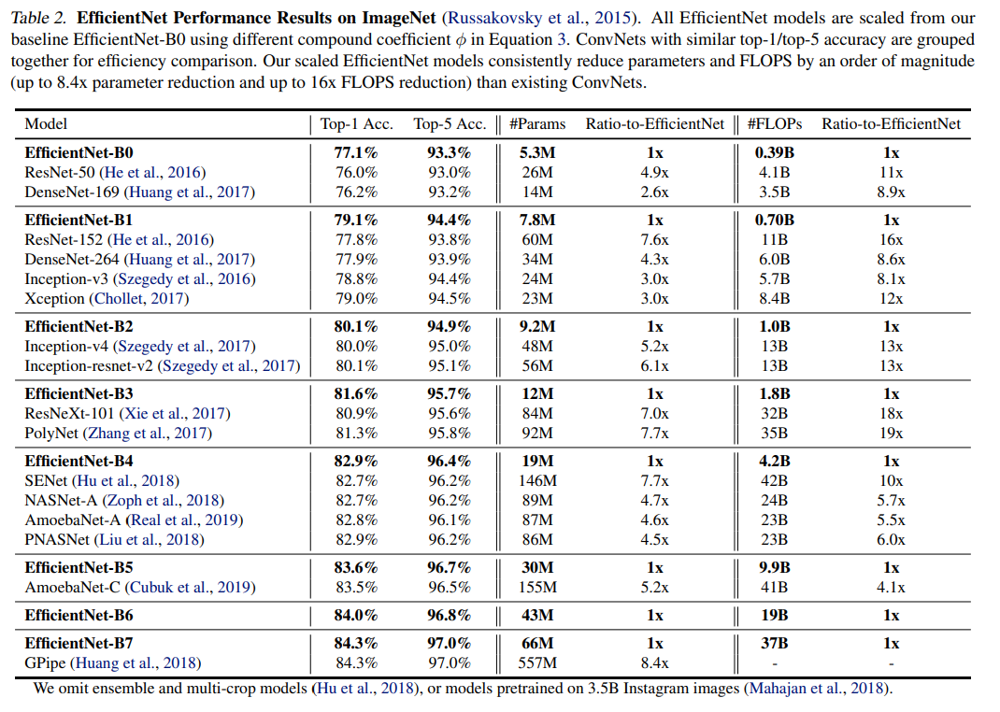
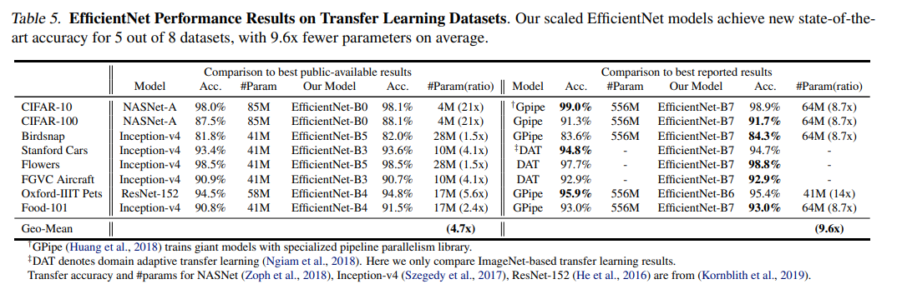
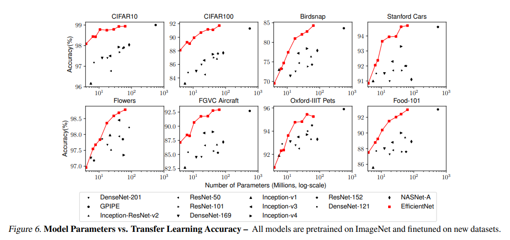

# EfficientNet paper Summary

## 1. 논문 정보
- 제목: EfficientNet: Rethinking Model Scaling for Convolutional Neural Networks
- 저자: Mingxing Tan, Quoc V. Le

## 2. Abstract 요약
- 기존 ConvNet(Convolutional Neural Networks)은 고정된 자원 예산에서 설계된 뒤, 더 많은 자원이 있을 때만 단일 차원을 확장해 왔습니다. 이 논문은 깊이(depth), 너비(width), 해상도(resolution)를 균형 있게 동시에 확장하는 Compound Scaling 기법을 제안합니다. Neural Architecture Search를 사용해서 EfficientNet을 개발했고, ImageNet에서 "84.3% top-1" 정확도를 기록하며 기존 모델보다 "8.4배 작고 6.1배 빠릅니다". CIFAR-100(91.7%), Flowers(98.8%) 등 5개 데이터셋에서도 파라미터 수를 크게 줄이면서 최고 성능을 달성하며 전이학습에서 우수한 성능을 보였습니다.

## 3. 문제 정의 및 동기
- ConvNets는 더 높은 정확도를 위해 depth, width, resolution을 개별적으로 확장해 왔습니다. 이 것들을 개별적으로 확장하는 것은 자원 활용과 성능 간 균형을 맞추기 어려우며, depth, width, resolution을 임의로 조합하는 기존 방식은 수작업 튜닝이 필요해서 비효율적이고 최적화가 쉽지 않습니다. 그리고 이 논문 작성 시점에서 하드웨어 메모리의 한계 때문에 확장으로 인한 정확도 향상 뿐만 아니라 효율성 개선도 필요한 상황입니다. 그리고 이전 연구들은 정확도와 효율성을 모두 향상시키기 위해 ConvNet을 효과적으로 스케일링하는 방법을 찾아내지 못했습니다.

## 4. 핵심 아이디어
- 이 논문은 세 차원을 모두 고려해 균형 있게 확장해야 최적의 정확도와 효율성을 달성할 수 있음을 확인했습니다. user-specific coefficient인 ϕ 와 그리드 탐색을 사용해서 얻은 depth, width, resolution의 constants 를 활용해서 이 세 차원을 균형있게 확장하는 방법을 제시합니다. Neural Architecture Search를 사용해서 EfficientNet-B0를 얻고 Compound Scaling을 사용해서 B1 ~ B7을 얻었습니다.

## 5. 방법론
-  을 사용해서 user-specific coefficient인 ϕ 는 얼마나 많은 자원을 사용할 수 있는지를 제어하고, 이 하나로 세 차원을 균형있게 확장합니다. 각 차원인 α,β,γ 는 이 자원을 각 네트워크의 depth, width, resolution에 얼마나 할당할지 결정하고, 이 값들은 작은 그리드 탐색을 사용해서 결정합니다. 그리고 FLOPS는  처럼 증가되고, 제약 조건을  로 설정했기 때문에 최종적으로 전체 FLOPS는 2^ϕ 만큼 증가됩니다.
- Neural Architecture Search를 활용해서 네트워크를 개발할 때 (Tan et al., 2019)에서 사용한 것과 동일한 Search Space를 사용했고,  를 최적화 목표로 설정했습니다. 여기서 T는 목표하는 FLOPS 이고, w는 -0.07로 정확도와 FLOPS 사이의 균형을 조절하는 하이퍼파라미터 입니다. 이러한 과정으로 EfficientNet-B0를 설계했습니다. 이 B0 모델을 기반으로 두 단계의 Compound Scaling 기법을 적용해서 B1 ~ B7 모델로 확장했습니다. 우선, ϕ 를 1로 고정하고 자원을 2배 정도 사용 가능하다고 가정한 뒤, 수식2와 수식3을 기반으로 α,β,γ 에 대해 작은 그리드 탐색을 수행합니다. 이 논문에서는 α=1.2,β=1.1,γ=1.15 가 가장 좋은 성능을 내는 것을 발견했습니다. 그 다음에, 이러한 α,β,γ 값을 고정하고 ϕ 값을 변화시키면서 B1 ~ B7 모델로 확장합니다. 아래 이미지는 EfficientNet-B0의 네트워크 구조입니다. 각 stage마다 L ̂_i개 만큼의 층이 있습니다. B0는 MBConv를 핵심 블록으로 사용하고 있고, Squeeze-and-excitation을 추가하여 사용했습니다.

## 6. 실험 결과
- compound scaling method의 효과를 입증하기 위해, 기존의 MobileNets와 ResNet에 단일 차원 스케일링 방법을 적용한 것과 compound scaling method를 적용한 것을 비교한 표3가 아래 있습니다.

- EfficientNet을 ImageNet에서 학습할 때, decay=0.9 와 momentum=0.9인 RMSprop를 사용하고, batch norm momentum=0.99, weight decay=1e-5, 2.4 epochs 마다 0.97 배율로 감소하는 initial learning rate=0.256 를 사용했습니다. 그리고 SiLU, AutoAugment, survival probability가 0.8인 Stochastic Depth 기법을 사용했습니다. 모델의 크기가 커질수록 선형적으로 증가하는 dropout을 사용했습니다. 25K의 이미지를 minival set으로 분리하고, early stopping 기법을 수행했습니다. 이렇게 학습된 EfficientNet과 다른 모델을 비교한 표2가 아래 있습니다.

- EfficientNet 모델을 전이학습 데이터셋에서도 평가한 결과인 표5가 아래에 있습니다.

- 여러 모델들과 EfficientNet의 정확도-파라미터 수 곡선을 비교한 그림6가 아래에 있습니다.

## 7. 결론
- 이 논문이 제안한 compound scaling 기법은 기본 ConvNet을 어떤 자원 제약 조건에서든지 보다 체계적으로 모델을 확장하게 해주고, 모델의 효율성도 유지시켜줍니다. 이 기법을 기반으로 EfficientNet 모델을 효과적으로 확장할 수 있음을 보여주었고, ImageNet 및 5개의 전이 학습 데이터셋 모두에서 State-of-the-Art 정확도를 달성하면서 파라미터 수와 FLOPS를 10배 가까이 줄이는 결과를 보여주었습니다.

## 8. 느낀점
- 제가 나중에 프로젝트에서 해상도를 확장하려고 할 때, Compound Scaling 기법을 적용해볼 수 있을 것입니다. 이 논문은 이미지 분류 분야에서만 실험을 했는데, 물체 검출이나 이미지 분할 같은 분야로 확장한 논문을 읽어보면 도움이 될 것 같다고 느꼈습니다.

