# HyperSeg Summary
## 논문 정보
제목: HyperSeg: Hybrid Segmentation Assistant with Fine-grained Visual Perceiver

저자: Cong Wei, Yujie Zhong, Haoxian Tan

## Abstract 요약
기존 방법들은 복잡한 추론 분할에 대해 이미지 및 비디오에 모두 적응하기 어려운 한계점이 있습니다. 그리고 fine-grained (세밀한) 수준의 vision-language 상관관계를 정확히 이해하는 것을 어려워 합니다.

따라서 이 논문은 HyperSeg를 제안합니다. HyperSeg는 VLLM 기반 pixel-level 이미지 및 비디오 인식을 위한 범용 분할 모델입니다.

이 모델은 일반적인 분할 작업, 그리고 강력한 추론 능력과 world knowledge가 필요한 복잡한 추론 인식 작업을 수행할 수 있습니다.

HyperSeg는 VLLM의 인식 능력과 세밀한 시각 정보를 전부 활용하고자 합니다. 그래서 HyperSeg는 다양한 분할 작업을 위한 Hybrid Entity Recognition과 Fine-Grained Visual Perceiver Module을 통합합니다.

Hyperseg에 Temporal Adapter와 결합함으로써, HyperSeg는 temporal 정보의 포괄적인 이해가 가능합니다.

## 문제 정의 및 동기
기존 방법들은 Rudimentary Vision-Language 정렬 방법의 한계 때문에, 세부적인 정보를 이해하기 어렵습니다.

기존의 VLLM는 이미지 및 비디오 도메인 모두에서 가능한 범용 분할 프레임워크로써 활용되기 어렵고, 복잡한 비디오 추론을 위한 시간적 맥락 이해 능력이 부족합니다.

## 핵심 아이디어
### Hybrid Entity Recognition
Figure3-c에서 볼 수 있듯이, Generation과 Decoding 단계 모두에서 LLM을 활용하는 방식입니다.

생성에서만 사용하게 되면 객체 누락이나 중복 예측이 자주 발생하고, 디코딩에서만 사용하면 Mask Token이 의미 조건과 상호작용을 충분히 하지 못해서 분류 성능에 문제가 생깁니다.

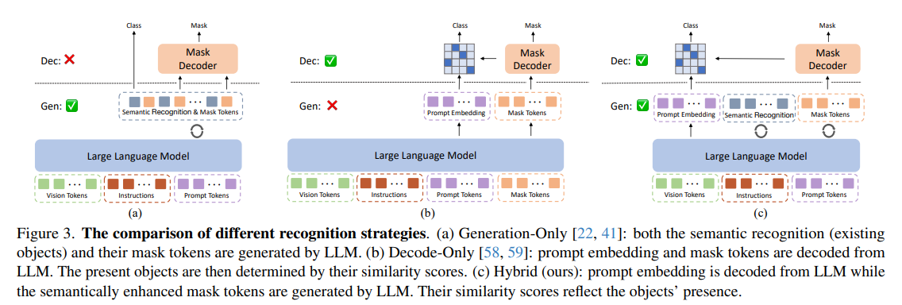

VLLM은 화면에 보이는 모든 객체의 이름을 먼저 생성한 뒤, 그 다음에 Semanticly Enhanced Mask Token을 생성합니다. 이 토큰은 이미지에 대한 통합된 의미 정보를 포함하고, 이후에 분할 예측기의 입력으로 사용되어 최종 Segmentation Mask를 생성합니다.

그리고 VLLM이 디코딩 방식으로 생성하는 Prompt Embedding을 사용해서 각 마스크 토큰을 마스크의 클래스 점수로 계산합니다.

### Fine-grained Visual Perceiver Module (FVP Module)
Figure4-b에서 볼 수 있듯이, Multi-Scale Visual 특징을 세분화된 토큰으로 융합합니다.

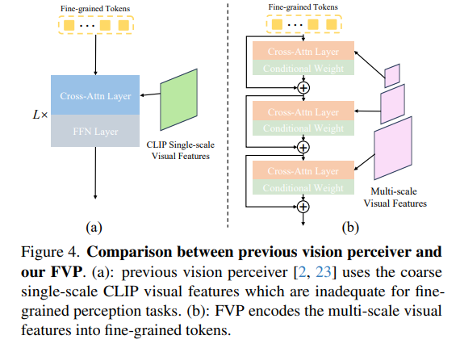

이를 통해 과도한 계산 비용 없이 사전 학습된 VLLM에 풍부한 fine-grained visual 정보를 주입할 수 있습니다.

피라미드 Visoin Encoder F_seg를 사용해서, 시각 입력 V로부터 이미지 특징 f_img를 얻습니다. f_img 는 세부 정보에 민감한 특징이 있습니다.

FVP 모듈은 Conditional Weighted Cross-Attention을 통해 각 토큰을 Eq5~6으로 풍부화합니다.

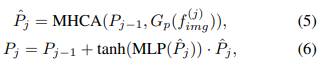

위 수식에서 MHCA는 Multi-Head Cross-Attention Layer 이고, G_p는 projection Function이고, tanh는 Normalizaton Function 입니다.

Eq5를 수행해서 이전까지의 fine-grained 토큰 P_j-1에 시각정보를 주입합니다.

Eq6에서, tanh(MLP()는 조건부 가중치로서 사용되고, 이전 토큰 P_j-1에 잔차 연결을 수행하기 전에 이 조건부 가중치[tanh(MLP())]를 풍부화된 정밀 시각 토큰 P\hat_j에 곱합니다.

이 논문은 다양한 Multi-Scale Image Feature에 대한 적응과 학습 안정성을 유지하기 위해 초기 가중치 값을 0으로 설정했습니다.

### Temporal Adapter
복잡한 비디오 인식 과제를 해결하기 위해, 시간 축에서 global prompt Aggregation과 Local Space-time Information Injection을 활용하고자 합니다.

Global Prompt Aggregation. 현재 프롬프트 임베딩 E_p에 시간 축을 따라 적응적 평균 풀링 전략을 사용해서, 이전 T 프레임들의 전역 객체 정보와 시간 정보를 집약합니다.

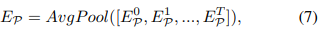

Local Space-Time Information Injection. 인접 프레임의 객체 정보를 주입하기 위해, Sequential Renewal 전략을 사용합니다. 

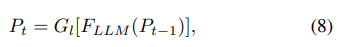

위 수식에서 P_t는 현재 t번째 프레임의 시간 인식 정밀 토큰을 의미하고, G_t는 이전 특징을 현재 시공간으로 전달하고 특징 차원 정렬하는 투영 함수입니다.

Global Prompt Aggregation과 Local Space-Time Information Injection은 장기-단기 Vision-Language 정보를 효과적으로 coalescence합니다.

### Prompt Design
프롬프트를 Text Prompt와 Visual Prompt로 통합하여, 다양한 분할 작업을 일관되게 다루었습니다.

## 방법론
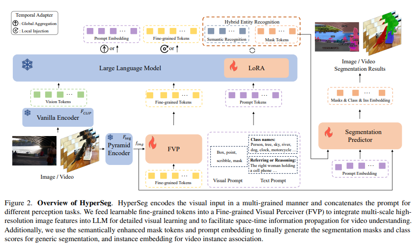
### Overall Architecture
HyperSeg는 fine-grained pyramid visual Encoder와 경량 VLLM과 Segmentation Predictor로 구성되어 있습니다.

fine-grained visual information을 기반으로, VLLM은 다음의 세 가지 종류의 입력을 받습니다.
1. CLIP 인코더로 인코딩된 시각 토큰
2. 갱신된 정밀 토큰
3. 다양한 지시를 위한 프롬프트 토큰

VLLM이 생성한 Semanticly Enhanced Mask Token과 프롬프트 토큰의 출력 임베딩은 분할 예측기에 전달되어, 최종 분할 결과를 생성합니다.

Global Prompt Aggregation과 Local Space-Time Information Injection을 사용해서 포괄적인 비디오 이해를 수행합니다.

LLM fine-tuning에서 LoRA를 사용해서 효율적인 파라미터 튜닝을 수행합니다.

사용자는 이미지 또는 비디오와, Prompt를 입력으로 넣어줍니다. 그리고 이미지 또는 비디오 분할 결과를 출력으로 얻습니다.

### VLLM
CLIP Encoder (F_CLIP)에 저해상도로 리사이즈된 비디오를 통과시켜서 f_v를 추출합니다.

f_v를 여러 종류의 task-specific Token으로 통합하여 멀티모달 입력의 복합적 의미를 포착합니다.

f_v를 LLM의 입력 차원에 맞게 투영합니다.

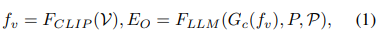

LLM은 G(f_v)와 fine-grained Token과 Prompt를 입력으로 해서 최종 출력인 E_O를 생성합니다.

E_O에서 Semantically Enhanced Mask Token인 E_Q와 Prompt Embedding E_P를 추출합니다. 여기에 추가적으로 f_img까지 총 3개의 입력을 Segmentation Predictor에 입력시킵니다.

### Loss Function
HyperSeg는 Multi-Task를 하나의 통합 손실 함수로 학습합니다.

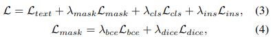

text 예측을 위해 autoregressive cross entropy loss인 L_text를 사용했습니다.

마스크 감독에 L_mask를 사용했습니다. L_mask는 L_bce와 L_dice의 가중합으로 구합니다.

Cross Entropy 손실 함수로 L_cls를 사용합니다.

비디오 시퀀스 사이의 인스턴스 연관을 위해 L_ins를 사용합니다.

### Vanilla Encoder
입력 영상 V를 저해상도로 리사이즈한 뒤, CLIP 인코더 F_CLIP에 통과시켜서 Global Vision Token f_v를 얻습니다.

### Pyramid Encoder F_seg
원본 해상도에 가까운 Multi-Scale Feature인 f_img를 추출합니다.

### FVP (Fine-grained Visual Perceiver)
Pyramid Encoder의 Multi-Scale Feature인 f_img를 고정 길이 토큰 P로 변환해서 LLM에 상세한 시각 정보를 주입합니다.

### Vision-Language LLM (VLLM) + LoRA
CLIP 인코더로 인코딩된 시각 토큰, FVP가 생성한 정밀 토큰, 사용자의 다양한 지시를 위한 프롬프트 토큰을 입력 받습니다.

이 부분은 사전 학습도니 경량화 LLM에 LoRA 기법을 적용해 효율적으로 파인튜닝 되었습니다.

### Segmentation Predictor
LLM의 출력인 Prompt Embedding과 Semantically Enhanced Mask Tokens과 f_img를 입력으로 받습니다.

이를 통해 픽셀 단위의 {mask, class, Ins Embedding}을 생성합니다.

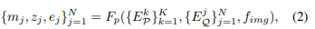

### Temporal Adapter
비디오 분할을 위해 시간 축 정보를 통합하거나 갱신하는 모듈입니다.

Global Prompt Aggregation은 과거 T 프레임의 Prompt Embedding을 시간 축으로 Average Pooling하여 Long-term 객체 및 시간 정보를 합칩니다. 이렇게 얻은 E_p는 Prompt Embedding의 입력으로 VLLM에 들어가서 장기 문맥을 반영합니다.

Local Space-Time Information Injecton은 직전 프레임의 fine-grained Token을 LLM에 통과시켜서 Short-term 연속성을 반영한 토큰으로 갱신시킵니다. 이렇게 갱신된 P_t는 fine-grained Token의 입력으로 VLLM에 다리 들어가서 단기 연속성을 유지합니다.

### Hybrid Entity Recognition
VLLM의 생성 능력과 디코딩 능력을 사용해서, Mask Token에 풍부한 범주 의미를 부여하고 안정적인 클래스 분류를 유지하게 합니다.

## 실험 결과
Table1은 gRefCOCO에서 HyperSeg와 기존의 SOTA 기법을 비교한 표입니다.

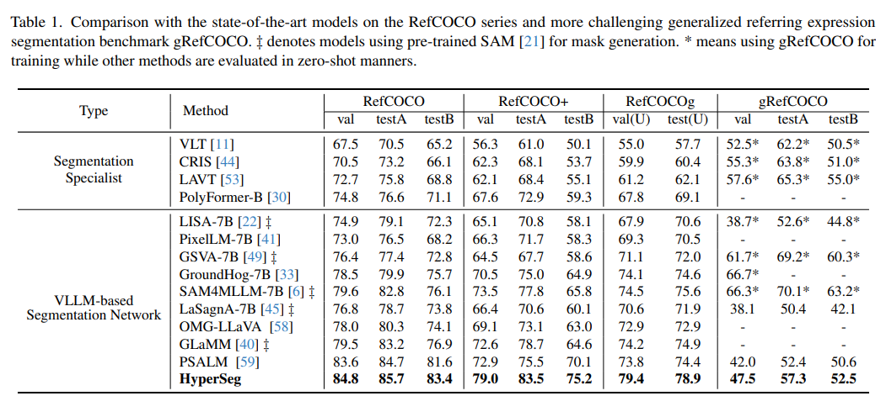

Table2는 Image Reasoning Segmentation과 Reasoning Video Object Segmentation에서 HyperSeg와 다른 최신 기법들을 비교한 표입니다.

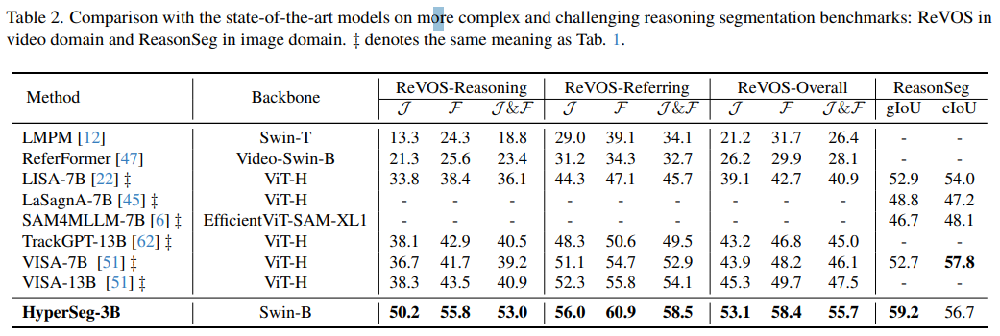

Table3는 COCO-Panoptic과 Open Vocabulary Segmentation에서 HyperSeg의 성능을 제시한 표입니다.

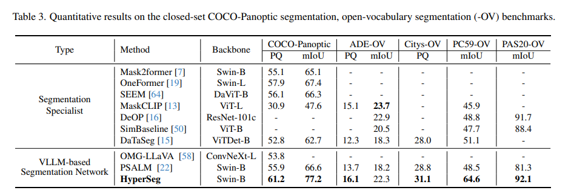

Table4는 기존의 비디오 분할 기법들과 HyperSeg를 비교한 표입니다.

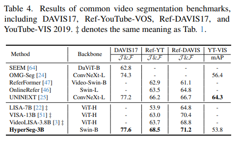

## 결론
HyperSeg는 VLLM 기반의 Image/Video의 픽셀 수준 인식을 위한 범용 분할 모델입니다.

일반적인 분할 작업부터 복잡한 추론 작업까지 넓은 범위로 사용될 수 있습니다.

Hybrid Entity Recognition과 Fine-Grained Visual Perceiver를 사용해서 VLLM의 인식 능력을 효과적으로 활용했습니다. 이 뿐만 아니라 과도한 계산 비용 없이 다양한 수준의 시각 정보를 포착했습니다.

HyperSeg는 Temporal Adapter를 사용해서 전역 및 지역 정보를 통합하고 복잡한 비디오 작업을 처리합니다.

## 느낀점

