## 1. 논문 정보
제목: MambaVision: A Hybrid Mamba-Transformer Vision Backbone

저자: Ali Hatamizadeh Jan Kautz

## 2. Abstract 요약
Vision 응용 분야에 특화된 새로운 Hybrid Mamba Transformer Backbone인 MambaVision을 제안합니다.
Mamba를 시각적 특징을 처리할 수 있게 재설계했으며, Mamba에 Self-Attention을 추가하여 Mamba와 Vision Transformer를 결합하여 성능 향상을 확인했습니다.

ImageNet-1K 데이터셋의 이미지 분류 실험에서, MambaVision 계열 모델들은 Top-1 정확도와 이미지 처리량 측면에서 State-of-the-Art 성능을 달성했습니다.
그리고 객체 검출, 인스턴스 분할, 의미 분할 등의 DownStream 과제에서 유사한 크기의 다른 Backbone 보다 우수한 성능을 보였습니다.

## 3. 문제 정의 및 동기
### Mamba
Mamba는 Transformer의 대안으로 제안된 Selective State Space Model(SSM) 계열의 대표적 아키텍처입니다. Mamba는 기존 Transformer가 갖는 O(N^2 ) 연산 및 메모리 부담을 선형 시간 복잡도(Linear Time Complexity)로 경감하면서도 content based 정보 선택 기능을 도입해 언어 모델링, 오디오, 게놈 데이터 등 다양한 시퀀스 작업에서 Transformer와 동등하거나 더 나은 성능을 보여줍니다.

Mamba는 Transformer를 대체할 수 있는 범용 시퀀스 백본으로서, 연산 효율, 콘텐츠 기반 추론, 단순 경량화 구조를 동시에 만족시키며 등장했고, 다양한 후속 연구를 통해 확장 및 개선되고 있습니다.

Mamba의 AutoRegressive 방식은 순차 데이터를 처리하는 데 효과적이지만, 컴퓨터 비전 분야에서는 한계점을 가집니다. 왜냐하면 컴퓨터 비전은 전체 수용장(Recep-tive Field)를 활용하기 때문입니다. AutoRegressive는 데이터를 단계별(Step-by-step)으로 처리하므로, 하나의 Forward Pass (순전파)에서 전체적인 문맥(Global Con-text)를 효과적으로 포착하는 데 한계가 있습니다.

컴퓨터 비전 작업에서 Local 영역을 정확하게 예측하기 위해서는 Global 문맥을 고려하는 것이 필수이기 때문에, 기존의 Mamba는 비전 작업에 적합하지 않습니다. 여기서 AutoRegressive는 시퀀스 데이터를 처리할 때, 현재 시점의 출력이 이전 시점의 출력에만 의존하도로 설계된 것을 말합니다.

이 방식으로 학습할 때, 입력 시퀀스를 한 단계씩 읽어서 그 이전까지의 정보만으로 “다음 토큰”을 예측하도록 손실(loss)을 계산합니다. 그리고 추론할 때 실제 생성 단계에서도 토큰을 하나 예측하면, 그 결과를 다시 모델에 입력하여 다음 토큰을 예측하는 과정을 반복합니다.

이로 인해 한 번의 Forward Pass(순전파)당 한 단계만 처리할 수 있습니다.

Sequence Data는 order(순서)가 중요하지만, 이미지 픽셀은 Sequence 데이터와 동일한 방식으로 순차적 종속성(Sequential Dependency)를 가지지 않습니다. 따라서 기존 Mamba의 순차적 처리 방식은 공간적 데이터를 처리하는 데 비효율적입니다.

### Vision Mamba (Vim)
Vim은 Mamba 구조를 기반으로 양방향 SSM(State Space Model) 공식을 사용했습니다. 토큰을 forward와 backward로 처리하여 더 넓은 Global Context를 포착하고 공간적 이해(Spatial Understanding)을 향상시키고자 했습니다.

Vision Mamba (Vim)는 전체 시퀀스를 처리한 후에 예측을 수행해야 해서 실시간 처리가 필요한 응용에서는 Latency(지연)이 크게 증가할 수 있다는 단점이 있습니다. 또한 모델의 구조가 복잡해지면서 학습이 어려워질 가능성도 있고, Overfitting의 위험이 높아질 수도 있습니다.

### VMamba
VMamba는 Cross-Scan Module(CSM)을 도입해서 1D Selective Scan 방식을 활용하는 Mamba 기반 Vision Backbone입니다. CSM은 4방향 Selective Scan을 적용하여 주변 토큰의 정보를 통합하고 더 넓은 Global Context를 포착합니다.

VMamba는 Depth-wise Convolution과 Hierarchical Multi-resolution Structure를 포함하는 구조적 변화를 적용했습니다. VMamba는 Cross-Scan Paths에 의해 Receptive Field가 제한되는 문제가 있습니다.

즉, Vmamba의 CSM은 1D인 직선 형태의 Path로만 이루어져있기 때문에, 이 직선이 겹치지 않는 영역에 대한 reception field가 비어 있거나 희박해지기 때문에 완전한 전역 문맥을 한 번에 포착할 수 없습니다.

## 4. 핵심 아이디어
### Mamba Block + Transformer Block
기존 Mamba의 순차 데이터 처리에서의 장점과 Vision Transformer의 Global Context 포착 장점을 결합하기 위해 Mamba 블럭과 Transformer 블럭을 결합했습니다.

### Residual Learning
Conv Block 내부에 입력을 다시 더해줌으로써 입력과 크게 다른 부분에만 학습 자원을 집중하게 하는 잔차학습 효과와 기울기 소실 완화 효과를 가지게 했습니다.

### Regular Convolution
Stage3와 4에서 Causal Convolution을 Regular Convolution으로 대체함으로써 출력을 계산할 때 상/하/좌/우/대각선 정보들을 동등하게 참고합니다.

### With SSM and without SSM
Mamba Vision Mixer 블럭 내부에 SSM(Selective State Space Model)이 있는 흐름과 SSM이 없는 흐름으로 나눠서 SSM의 순차적 제약으로 인해 발생하는 정보 손실을 보완했습니다.

## 5. 방법론
### Macro Architecture
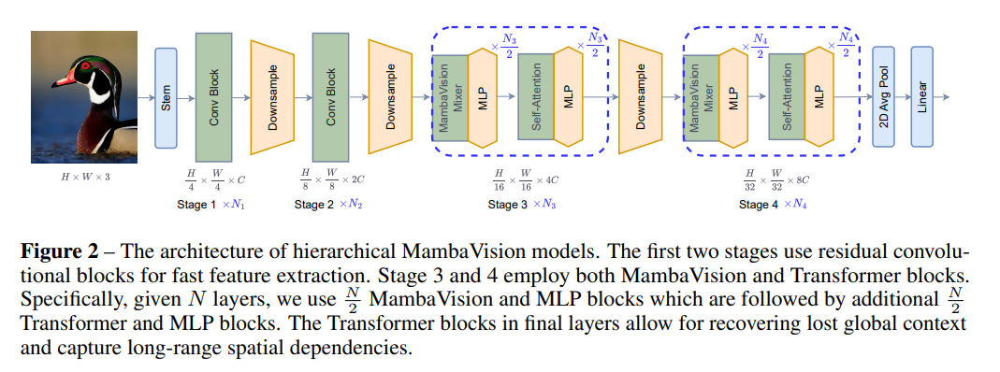

이 모델의 큰 틀이 어떻게 구성되어 있는지 확인해보면, H x W x 3 크기의 입력이 들어오면 Stem은 간단한 3 x 3 합성곱(Convolution) 2개(stride=2를 2번 적용했으므로 1/4 )로 H/4×W/4×C 크기의 특징을 추출합니다. 그 다음에 (Residual) Convolution Block을 N_1개 쌓아서 local feature를 빠르게 추출합니다. 그 다음에 Downsample을 통해 해상도를 절반으로 축소시키면서 채널 수를 2배로 늘립니다. 채널 수를 2배로 늘리는 이유는 낮아진 해상도로 인한 손실된 표현력을 보존하기 위해서입니다.

여기서 나온 H/8×W/8×2C 를 다시 N_2개의 (Residual) Conv Block과 Downsample에 순서대로 넣고 해상도가 절반인 H/16×W/16×4C를 출력합니다. 이제 N_3/2개의 MambaVision Mixer + MLP로 선형 시간 복잡도 하에 local 및 global 특징을 추출합니다. 그리고 N_3/2개의 Self-Attention + MLP로 부족해진 Global Context를 보완합니다.

그리고 DownSample를 거쳐서 절반 해상도인 H/32×W/32×8C 를 출력하고 이 것을 다시 Stage3와 동일한 과정을 거치게 합니다. 끝에는 2D Average Pooling을 통해 Stage4의 출력 맵을 채널별로 평균 연산하고, Linear Layer를 통해 최종 클래스 수로 선형 변환을 시킵니다.

(Residual)Conv Block 내부 구조는 아래 수식과 같습니다. 입력 z의 Local 패턴을 3x3 커널로 추출하고, Batch Normalization이라는 미니배치 단위로 채널별 분포를 정규화합니다.

그 다음에 Gaussian Error Linear Unit이라는 부드러운 비선형 활성화함수를 적용합니다. 이렇게 나온 z ̂에 3x3 커널로 local 패턴을 한 번 더 추출하고 BN으로 한 번 더 정규화한 뒤 마지막에 입력 z를 다시 더하는 구조입니다.

마지막에 z를 더해줌으로써 입력과 크게 다른 부분에만 학습 자원을 집중하게 되는 잔차학습 효과와 기울기 소실 완화 효과를 가지게 됩니다. 잔차 학습 효과란, 신경망이 입력 전체를 학습하는게 아니라 입력과 출력의 차이를 학습하게 하는 효과를 말합니다.

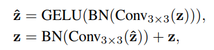

### Micro Architecture
Mamba Preliminaries: Mamba는 1D의 연속적인 입력 x(t)를 학습 가능한 hidden State인 h(t)를 거쳐서 y(t)로 변환합니다. 즉, Mamba는 State Space Model을 기반으로 동작합니다.

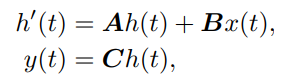

A는 state transition(상태 전이) 매트릭스로, 이전 상태 h(t)가 현재 상태 변화 h’(t)에 얼마나 어떻게 기여하는지를 결정합니다. B는 입력 매트릭스로, 입력 신호 x(t)를 은닉상태에 어떻게 통합시킬지 정의합니다. 현재 입력이 상태 변화에 얼만큼 어떤 방향으로 영향을 미칠지 결정합니다.

C는 출력 매트릭스로, 은닉 상태 벡터 h(t)의 어떤 조합이 출력으로 중요하게 반영될지를 결정합니다. 즉, Ah(t)는 과거 정보를 누적하고, Bx(t)는 새로운 신호를 반영하고, Ch(t)는 원하는 형태로 요약하는 역할을 합니다.

여기서 계산 효율성을 높이기 위해 연속적 파라미터 A, B, C는 이산적(Discrete) 매개변수로 변환됩니다. 즉, 위의 수식을 컴퓨터가 구현하기 쉽도록 일정한 시간 간격(∆) 단위로 끊어 쪼개어 처리합니다.

시간 척도(TimeSclae, ∆)를 추정하면, Zero-order Hold Rule을 적용하여 Discete(이산적) 매개변수를 얻을 수 있습니다.

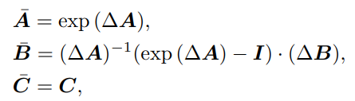

이제 Discrete 파라미터를 사용하여 h(t)와 y(t)를 표현하면, 

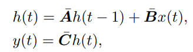 와 같은 선형 재귀식으로 바뀝니다.

크기가 T인 입력 시퀀스 x에 대해, 커널 K를 갖는 Global Convolution을 적용하여 최종 출력인 

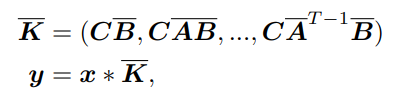 를 얻을 수 있습니다. 이를 통해 SSM 연산을 컨볼루션으로 치환해 빠르게 병렬화할 수 있습니다. 또한, Structured State Space Sequence Model을 확장하는 Selection Mechanism을 도입하여 입력에 따라 달라지는 시퀀스를 처리하게 했습니다.

이를 통해 매개변수 B, C, ∆가 입력에 따라 동적으로 조정되고 불필요한 정보를 걸러냅니다.

### Linear Architecture
이제 Stage 3, Stage 4의 Layer Architecture를 보자면, Mamba Mixer를 Vision 작업에 적합하게 하기 위해, Causal Convolution(인과적 합성곱)을 Regular Convolution(일반 합성곱) 으로 대체합니다.

Causal Convolu-tion은 영향을 한 방향으로만 제한하는데, 이는 Vision에서 불필요하기 때문입니다. causal Conv는 출력을 계산할 때 현재 시점 이전 입력만을 사용합니다. 이를 통해 미래 정보가 과거 예측에 영향을 주지 않는다는 인과정(causal)를 보장합니다.

Regular Conv는 2D 이미지 처리에 최적화된 표준 합성곱 연산입니다. 출력을 계산할 때 상/하/좌/우/대각선 정보를 동등하게 참고합니다. 

아래 그림은 MambaVision Mixer 블록의 내부 구조입니다. 이를 보면 SSM이 있는 흐름과, SSM이 없는 흐름이 있습니다. 첫 번째 분기를 거쳐서 Sequential과 Local 정보를 추출하고, 첫 번째 분기에서 SSM을 없애고 추가적인 컨볼루션과 SiLU 활성화 함수를 포함하는 두 번째 분기를 추가하여 SSM의 순차적 제약으로 인해 발생하는 정보 손실을 보완했습니다.

그 다음에 이 두 흐름을 연결한 후 최종적인 선형층을 통해 투영합니다. 이런 방식은 최종 특징 표현이 순차적 정보와 공간적 정보를 모두 포함할 수 있게 합니다. 즉, 풍부한 특징 표현을 제공하고 일반화 성능을 향상시키며 컴퓨터 비전 과업에서 더 나은 성능을 달성합니다.

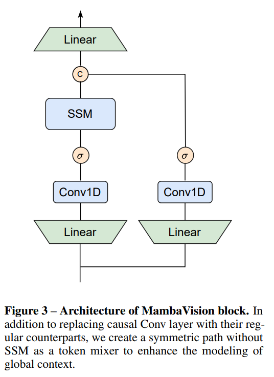

Linear를 통해 입력 채널 C를 중간채널 C/2로 축소하는 선영 투영을 합니다. Conv1D를 통해 1D 합성곱을 수행하고, 𝜎를 통해 SiLU 활성화함수를 적용합니다. SSM은 원래의 SSM 기반 선택적 스캔 연산을 의미합니다.

c는 Concat으로, 두 분기에서 얻어진 C/2 채널의 출력을 이어붙여서(Concat) C채널로 만드는 과정입니다. 여기서 사용하는 Self-Attention은 일반적인 Multi-Head Self-Attention 매커니즘입니다.

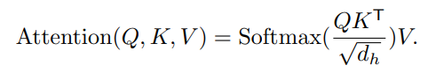

MambaVision은 고해상도에서 Stage1과 Stage2의 CNN을 활용하여 빠른 특징 추출을 수행하고, 저해상도에서 SSM과 Self-Attention을 함께 사용하여 short-Range 및 Long-Range 공간적 의존성을 효과적으로 포착하도록 설계됐습니다.

## 6. 실험 결과
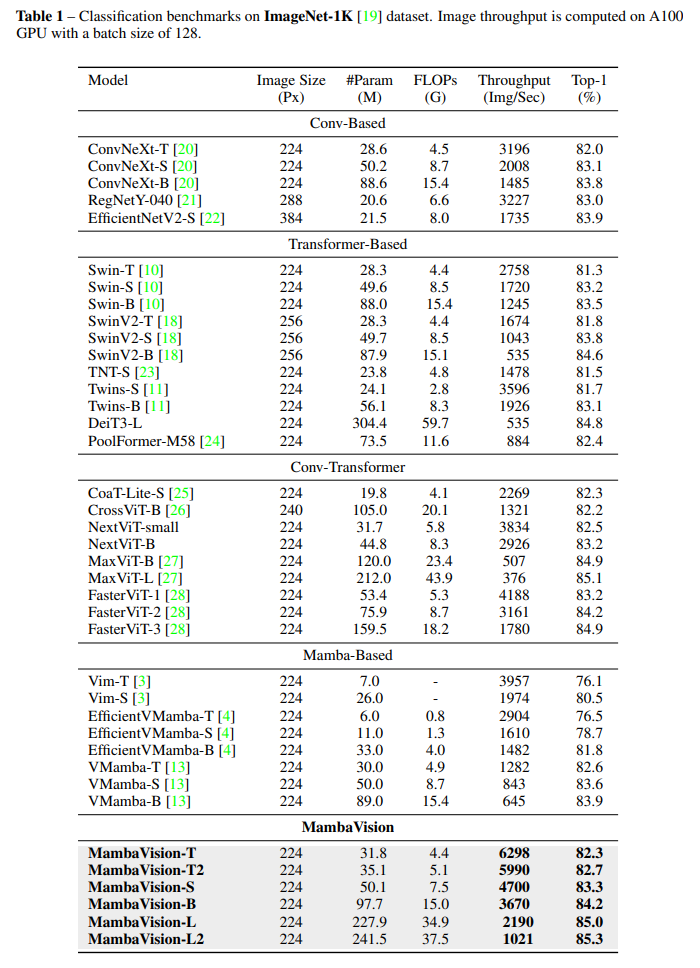

Table1은 ImageNet-1k로 평가한 분류 벤치마크입니다. 기존 ImageNet 벤치마크와 동일한 성정으로 분류 헤드만 사용하여 평가했습니다.

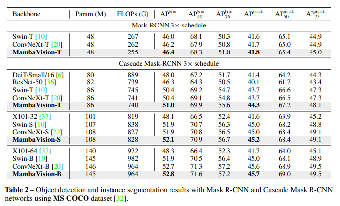

MS COCO 데이터셋에서 평가한 object detection 및 instance segmentation 벤치마크 입니다.

여기서 MambaVision 백본을 Mask-RCNN 검출 헤드와 결합하여 벤치마킹했습니다.

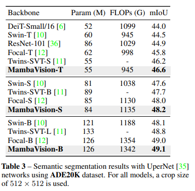

여기서는 MambaVision 백본 위에 UperNet 네트워크를 헤드로 붙여서 semantic Segmentation을 수행한 결과 표입니다.

## 7. 결론
MambaVison은 Vison을 위한 Mamba-Transformer Hybrid Backbone입니다. Global Context Representation Learning 능력 향상을 위해 기존의 Mamba 구조를 재설계했습니다.

MambaVision은 Top-1 정확도와 이미지 처리 속도 측면에서 State of the Art를 달성했고, Transformer 기반 모델과 Mamba 기반 모델들과 격차를 벌렸습니다.

## 8. 느낀점
