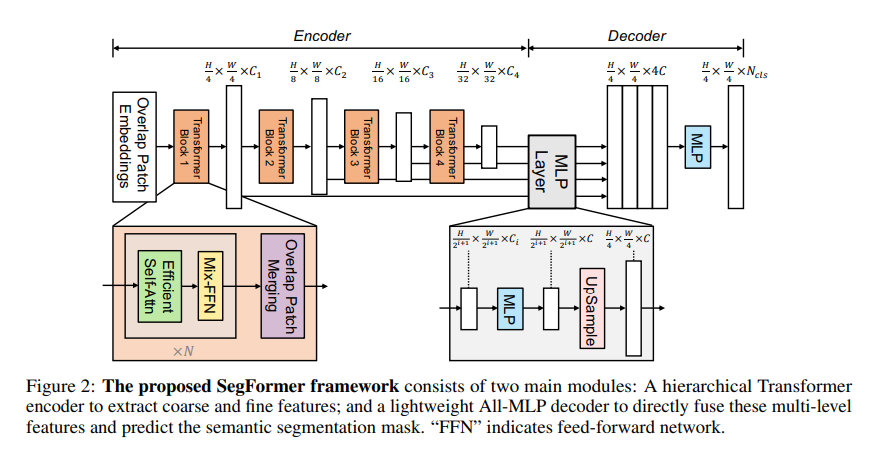
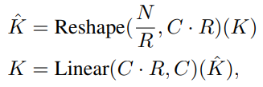
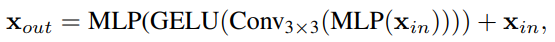
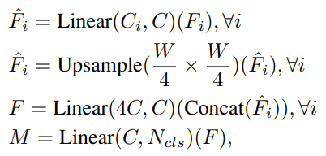
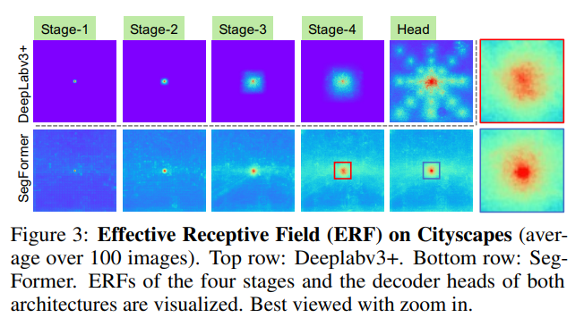
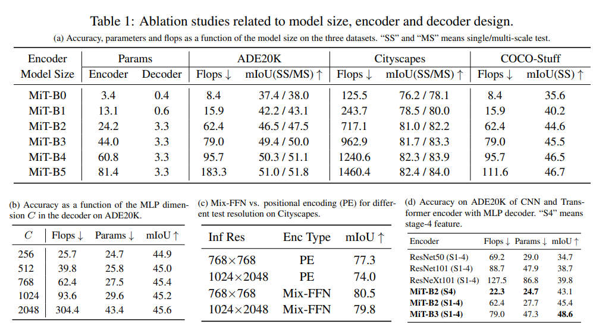
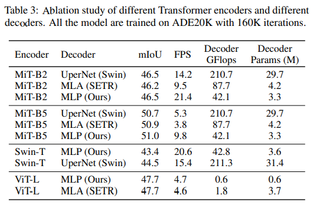
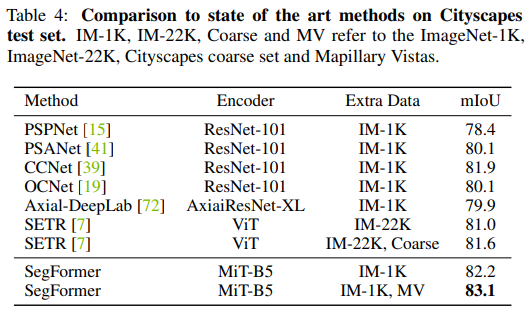
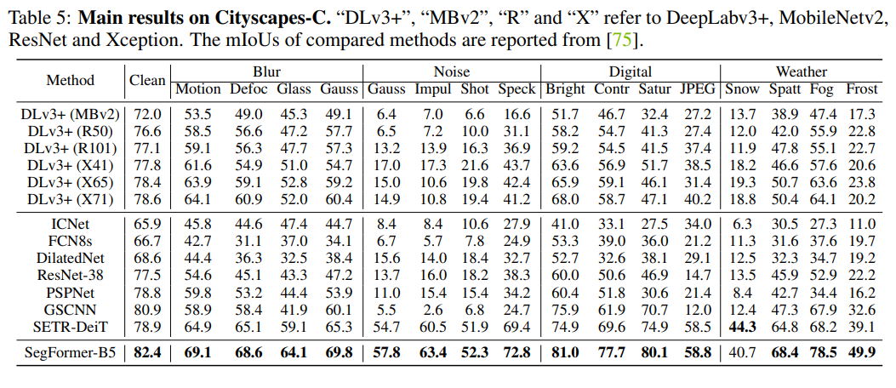

# SegFormer paper Summary
## 1. 논문 정보
제목: SegFormer: Simple and Efficient Design for Semantic Segmentation with Transformers

저자: Enze Xie, Wenhai Wang, Zhiding Yu, Anima Anandkumar, Jose M. Alvarez, Ping Luo

## 2. Abstract 요약
SegFormer는 단순하고 효율적이며 강력한 Semantic Segmentation Framework입니다. SegFormer는 Transformer와 경량의 MLP 디코더를 통합한 구조입니다.

SegFormer는 계층적으로 구성된 새로운 Transformer 인코더를 사용하여 Multiscale Feature를 출력합니다. 이 인코더는 Positional Encoding을 사용하지 않기 때문에 Test Resolution과 Training Resolution이 다를 때 발생하는 위치 코드 보간에 대한 성능 저하가 발생하지 않습니다. 그리고 SegFormer는 복잡한 디코더를 사용하지 않고 논문이 제안한 MLP 디코더를 사용합니다. 이 디코더는 서로 다른 층의 정보를 집계하여 Local Attention과 Global Attention을 모두 결합하여 강력한 표현력을 제공합니다.

이 논문에서는 SegFormer-B0 부터 B5까지 모델을 확장했으며, SegFormer-B4는 ADE20K에서 64M 파라미터로 50.3% mIoU를 달성함과 동시에 이전의 최고 방법보다 모델의 크기가 5배 작고 성능이 2.2% 더 우수합니다. SegFormer-B5는 Cityscapes 검증 세트에서 84% mIoU를 기록하고 Cityscapes-C에서 Zero-shot 강건성을 보여주었습니다.

## 3. 문제 정의 및 동기
Pyramid VisionTrnasformer와 Swin Transformer, Twins 등의 최신 방법들은 주로 Transformer의 인코더 설계에 집중했고, 더 나은 성능을 위한 디코더의 설계는 상대적으로 간과했습니다. 이에 논문의 저자는 기존 방법들과 달리 인코더와 디코더를 모두 새롭게 설계하고자 합니다.

## 4. 핵심 아이디어
Positional Encoding이 없는 새로운 hierarchical Transformer 인코더와 복잡하고 계산량이 많은 모듈 없이도 강력한 표현력을 제공하는 경량 All-MLP 디코더 설계를 통해 세 가지 공개 Semantic Segmentation 데이터셋에서 효율성, 정확도, 강건성의 State-of-the-Art를 달성했습니다.

Positional Encoding을 제외함으로써 Test와 Training의 이미지 해상도가 다를 경우 위치 코드 보간을 하지 않도록 했습니다. 이를 통해 성능 저하 없이 임의의 테스트 해상도에 유연하게 대처할 수 있습니다. 그리고 hierarchical 구조를 통해 고해상도의 정밀한 특징과 저해상도의 거친 특징을 모두 생성할 수 있습니다.

경량 MLP 디코더는 Transformer의 하위 계층 Attention이 Local에 집중하고 상위 계층 Attention이 Global에 집중하는 것을 바꿨습니다. 경량 MLP 디코더는 Local과 Global Attnetion을 모두 통합할 수 있게 해서, 단순하고 직관적인 디코더 구조로 강력한 표현력을 얻었습니다.

## 5. 방법론
Figure2는 SegFormer의 구조를 보여줍니다.

### Hierarchical Transformer Encoder
아키텍처가 동일하지만 크기만 다른 Mix Transformer-B0 부터 B5까지 설계했습니다. Mix Transformer에는 PVT의 계층적 아키텍처 Efficient Self-Attention 모듈 위에 Overlapped Patch Merging을 추가하고 Positiona-Encoding-Free Design을 사용했습니다. 인코더에는 입력 이미지를 기반으로 multi-level multi-scale 특징들을 생성합니다. 이러한 특징들은 고해상도의 거친 특징과 저해상도의 세밀한 특징을 함께 제공하기 때문에 Semantic Segmentation 성능을 향상시킵니다. 각 Transformer Block 안에 Overlap Patch Merging을 수행해서 해상도가 H/2^(i+1) x W/2^(i+1) x C_i 인 Hierarchical Feature map을 생성합니다.

계층적 특징 표현은 높은 해상도의 특징으로부터 긴 시퀀스가 생성될 때 self-Attention의 복잡도가 제곱 형태가 되는 문제가 있어서, Transformer 불록 안의 Multi-head Self-Attention에 Sequence Reduction 기법을 적용합니다. 아래 eq2인 Sequence Reduction을 사용하여 시퀀스 길이를 줄입니다. 첫 번째 식은 K를 N/R x (C ⋅ R) 형태로 변형하고, 두 번째 식은 (C ⋅ R) 차원의 텐서를 입력으로 받아서 C 차원의 텐서를 출력하는 선형 계층을 나타냅니다. 새로운 K는 N/R x C 의 차원을 가지게 되고, 이로 인해 Self-Attention의 복잡도 O(N^2)가 Efficient Self-Attention의 복잡도 O(N^2/R)로 줄어들게 됩니다. 논문의 저자는 실험을 통해 Stage1 ~ 4까지의 R값을 {64, 16, 4, 1}로 설정했습니다.

이웃한 패치 사이의 Local Continuity(연속성)를 유지하기 위해, Overlapping Patch Merging을 사용합니다. 이를 위해서는 Patch Size는 Stride Size보다 커야 합니다. 따라서 K(patch size), S(stride between two adjacent patches), P(padding size)를 정의하고, K=7 / S=4 / P=3 과 K=3 / S=2 / P=1로 설정하고 이 값으로 Overlapping Patch Merging을 수행했습니다. 이를 통해 non-overlapping과 동일한 크기의 특징을 생성합니다.

Test와 Training 이미지의 해상도 불일치는 Semantic Segmentation에서 자주 발생하고, 이로 인해 Positional Encoding을 보간(interpolate)해야 하고, 이는 성능 하락으로 이어집니다. SegFormer는 Positional Encoding을 제거하고 Mix-FFN을 도입했습니다. FFN에서 3x3 Conv를 직접 사용해서 Zero-Padding으로 인해 위치 정보가 새어나오는 효과를 활용할 수 있습니다. Zero-padding을 통해 0이 위치한 곳이 이미지의 바깥쪽이라는 것을 간접적으로 인지할 수 있습니다.

Mix-FFN의 수식은  입니다. 이 수식에서 x_in은 Self-Attention 모듈에서 나온 Feature이고, Mix-FFN은 FFN에 3x3 Conv 와 MLP를 혼합하여 사용합니다. 그리고 파라미터 수를 줄이고 효율성을 높이기 위해 Depth-wise Convolution을 사용합니다.

### Lightweight All-MLP Decoder
SegFormer의 Lightweight All-MLP Decoder는 오직 MLP 계층만으로 이루어진 간단한 디자인을 가지고 있습니다. 이 디코더의 동작은 아래 수식을 따릅니다.

위 수식에서 Linear(A, B)는 입력 차원이 A이고 출력 차원이 B인 Fully-Connected Layer를 의미합니다.

우선, 채널 수를 통일하기 위해 MiT 인코더에서 얻은 특징들을 Linear(C_i, C) 계층을 통과시킵니다. 이를 통해 하나의 공통된 차원 C가 됩니다.

그리고 해상도를 맞추기 위해, H/4 x W/4 해상도로 업샘플링합니다. 이를 통해 서로 다른 해상도의 특징들을 같은 공간 크기로 맞출 수 있습니다.

네 단계에서 받은 H/4 x W/4 x C 크기의 특징을 concatenate한 뒤, Linear(4C, C)를 통해 C 차원으로 융합시킵니다.

융합된 특징을 Linear(C, N_cls)에 입력하여 최종 클래스 수 N_cls의 segmentation mask인 M을 직접 예측합니다.

SegFormer의 Effective Receptive Field를 보면, 기존의 CNN 기반 Segmentation 보다 우수한 점이 있습니다. 아래 Figure3를 보면, DeepLabv3+는 Stage4에서 Effective Receptive Field가 화면 중앙 근처에만 제한적으로 집중되지만 SegFormer는 Stage4에서 이미지 전체에 Effective Receptive Field가 넓게 퍼져 있습니다.

즉, SegFormer는 Stage4에서 전역 문맥을 자연스럽게 포착할 수 있습니다.

SegFormer는 Local과 Non-Local 정보를 동시에 포착합니다. MLP head를 보면 Stage4의 Non-Local Attention을 사용한 것 보다 중심부에 강한 Receptive Field가 나타나는 것을 볼 수 있습니다. 이를 통해 All-MLP 디코더는 Stage4에서 얻은 Non-Local과 MLP의 Local을 둘 다 사용합니다.

기존의 CNN에서는 Effective Receptive Field를 넓히기 위해 ASPP(Atrous Spatial Pyramid Pooling) 같은 무거운 Context 모듈을 사용해야 했지만, SegFormer는 Transformer 인코더가 충분히 큰 Effective Receptive Field를 제공하기 때문에 4개의 MLP 만으로 Local과 Non-Local 정보를 효과적으로 융합할 수 있습니다.

이를 통해 파라미터와 연산량이 줄어들고 모델의 구조가 단순해지는 장점이 있습니다.

## 6. 실험 결과
학습 과정에서 데이터 증강을 적용했습니다. 배율을 0.5 ~ 2.0 사이로 하고 Random Resize, Random Horizontal Flipping, Random Cropping을 적용했습니다. 그리고 AdamW Optimizer를 사용하여 ADE20K와 Cityscapes 데이터셋을 160K 반복하고, COCO-Stuff 데이터셋을 80K 반복하여 학습했습니다.

배치 사이즈는 ADE20K와 COCO-Stuff 에서 16, Cityscapes에서 8을 사용했습니다. 초기 Learning rate는 0.00006을 사용했고, factor가 1.0인 poly Learning rate schedule을 사용했습니다.

간단함을 유지하기 위해, OHEM, Auxiliary losses, class balance loss 등은 사용하지 않았습니다.

Semantic Segmentation의 성능 평가는 mIoU를 사용했습니다.

위 Table1(a)를 보면 인코더의 크기가 가장 작은 모델의 경우, 효율적이며 실시간 응용에 적합한 결과를 보여줍니다. 인코더의 크기가 가장 큰 모델의 경우, State-of-the-Art 성능을 달성했습니다.

Table1(b)에 따라, 채널 차원 값인 C가 증가할수록 성능이 향상되지만 768을 넘어가면 유의미한 성능 개선이 없습니다. 이를 통해 B0 또는 B1 모델에 C=256을 사용하여 실시간 응용 문제를 해결하고, 나머지 모델들은 C=768을 사용할 수 있습니다.

Table1(c)를 통해, Positional Encoding을 사용하지 않는 것이 성능 향상을 보이고, 해상도 변화에 덜 민감합니다.

Table1(d)를 보면, MLP 디코더를 CNN 인코더와 결합하는 것 보다 Transformer 인코더와 결합하는 것이 정확도가 더 높은 것을 알 수 있습니다.

Table3를 보면, Swin과 ViT와 MiT를 비교한 것을 볼 수 있습니다. 이를 통해 Semantic Segemntation에서 어떤 인코더와 디코더의 조합이 적절한지 확인할 수 있습니다.

Table4를 보면 Cityscapes 데이터셋에서의 모델 간 성능 차이를 확인할 수 있습니다.

Table5는 모델의 견고성을 비교한 것을 확인할 수 있습니다.

## 7. 결론
SETR과 SegFormer를 비교했을 때, SegFormer는 ImageNet-1K 만을 사용하여 사전학습했지만, SETR은 ImageNet-22K로 사전학습하여 사전 학습 크기에 차이가 있습니다.

SegFormer의 인코더는 hierarchical 구조를 가지고 있어서 ViT 보다 작고 고해상도와 저해상도를 모두 사용할 수 있습니다. 반면, SETR의 ViT 인코더는 하나의 저해상도 특징맵만 생성할 수 있습니다.

SegFormer는 인코더에서 Positional Embedding을 제거했지만, SETR은 고정된 Positional Embedding을 사용했습니다. Test와 Training의 해상도가 다를 경우 정확도를 떨어트리게 됩니다.

SegFormer의 MLP 디코더는 SETR보다 간단하고 연산 부담이 적습니다.

결론적으로, SegFormer는 Positional Encoding이 없는 Hierarchical Transformer 인코더와 lightweight All-MLP 디코더로 구성된 단순하고 강력한 Semantic Segmentation 방법입니다.

또한 Zero-shot 환경에서 강한 견고성을 보여줍니다.

다만, 일부 edge device에서 동작하기에는 무거운 모델이며, mixed-precision Training과 Pruning, Hardware-friendly Attention Design, Energy Consumption 등의 추가적인 연구가 필요합니다.
## 8. 느낀점
Semantic Segmentation과 같이, Test와 Train의 해상도가 다른 환경에서 Positional Encoding을 제거하면 성능 향상을 유도할 수 있다는 것을 알게 되었습니다.
