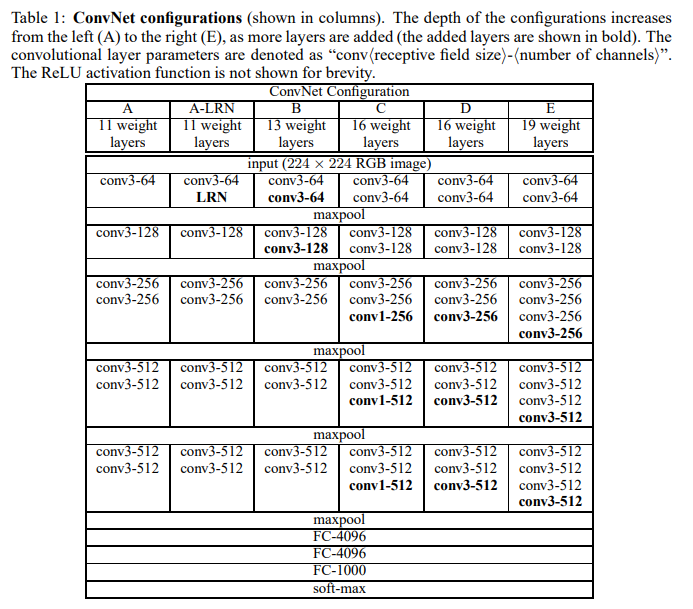

# VGG

## 핵심 아이디어

## 방법론

Input Layer takes input size of 224 x 224 RGB image.

This paper subtracted the mean RGB value from each pixel. This is only pre-processing in this paper.

It use 3 x 3 filters and stride 1 and padding 1. And it use 2 x 2 max pooling with stride 2.

A stack of convolutional layers is followed by three Fully-Connected layers. The first two have 4096 channels each, the third perform 1000-way classification and thus contains 1000 channels.

The final layer is softmax layer.

All hidden layers are use ReLU as activation function.

Local Response Normalization does not improve the performance on the ILSVRC, so this paper doesn't contain LRN execpt for one.

Number of channels are increasing by a factor of 2 after each max-pooling layer.

Instead of a single 7×7 convolutional layer, three 3×3 convolutional layers were used to construct a more discriminative decision function. This also helped reduce the number of parameters.

By using 1×1 convolutional layers with ReLU, it is possible to increase the non-linearity of the decision function without affecting the size of the receptive field.

## Training
momentum을 사용하는 mini-batch gradient descent로 Multinomial Logistic Regression 목적 함수를 최적화 합니다.

batch size는 256이고, momentum은 0.9 입니다. Learning rate는 10^-2로 설정했고, validation set의 accuracy가 더 이상 향상되지 않으면 learning rate를 10으로 나누었습니다. 총 3번의 학습률 감소가 있었고, 전체 학습은 370K회(74 epochs) 입니다.

Glorot & bengio (2010)의 무작위 가주치 초기화 방법을 사용하면 pre-training 없이도 가중치를 안정적으로 초기화할 수 있습니다.

## 결론
This paper evaluated very deep Convolutional Network for large scale image classification.

Representation Depth is beneficial for the classification accuracy.

Increassing depth, Convnetwork architecture achieved State-of-the-Art performance on the ImageNet.

This paper confirm the importance of depth in visual representations.
